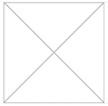

.. image:: ../../images/badges/badge_web.png
   :class: pull-right

Image
=====

The image control is used to display images. An image is specified with a url. Images can be from external or
internal sources. Internal sources can be imported using the Resources option in System Configuration & Settings in the
DreamFace Studio to add an image as a resource.

|

|

|

Features
--------
* Point to any image url or extend DreamFace by adding the image as a resource.

|

See it in Action
----------------

Try the Sample Images

.. toctree::
   :maxdepth: 1

   ../../gsguide/samples/sample-images

|

Reference
---------

The Image control properties can be set for the following property categories:

* :ref:`webgc-image-render-label`
* :ref:`webgc-image-styling-label`
* :ref:`webgc-image-events-label`

|

Main Properties
^^^^^^^^^^^^^^

.. toctree::
   :maxdepth: 1

   webgc-prop-main-id
   webgc-prop-main-template
   webgc-prop-main-name
   webgc-prop-main-label
   webgc-prop-main-icon
   webgc-prop-main-display
   webgc-prop-main-disable

|

Styling Properties
^^^^^^^^^^^^^^^^^^^

.. toctree::
   :maxdepth: 1

   webgc-prop-style-style
   webgc-prop-style-class
   webgc-prop-style-dynamic

|

+------------------------+-------------------+--------------------------------------------------------------------------------------------+
| **Main Properties**    | Possible Values   | Description                                                                                |
+========================+===================+============================================================================================+
| Source                 | url or            | The source of the image. This can be a url indicating the location of the image as shown in|
|                        | name of a resource| the placeholder in the field '/images/dfx_image_blank.png' surrounded by quotes or it can  |
|                        |                   | be the *name* of a resource that you have added to DreamFace in the Application > YourApp >|
|                        |                   | Configuration option of the the Application Explorer. For more information on Configuring  |
|                        |                   | Resources see
+------------------------+-------------------+--------------------------------------------------------------------------------------------+

|

.. _webgc-image-render-label:

Rendering
^^^^^^^^^

This is the rendering section.

|

.. _webgc-image-styling-label:

Styling Attributes
^^^^^^^^^^^^^^^^^^

+------------------------+-------------------+--------------------------------------------------------------------------------------------+
| **Styling Attributes** | Possible Values   | Description                                                                                |
+========================+===================+============================================================================================+
| Style                  | CSS syles         | CSS style attribure(s) to use for this component, separated by semi-colons, for example:   |
|                        |                   | *color:red; background-color:lightgray*.                                                   |
+------------------------+-------------------+--------------------------------------------------------------------------------------------+
| Classes                | CSS class         | Name of CSS class to use for the component.                                                |
+------------------------+-------------------+--------------------------------------------------------------------------------------------+
| Dynamic Classes        | CSS Class         | The Dynamic Class is a CSS class that will be added to the graphical control if an Angular |
|                        |                   | Expression is verified. It is rendered as a ng-class attribute.                            |
+------------------------+-------------------+--------------------------------------------------------------------------------------------+
| Width                  | number of pixels  | The width of the image in pixels, for example 150px, which is the default value.           |
|                        |                   |                                                                                            |
+------------------------+-------------------+--------------------------------------------------------------------------------------------+
| Height                 | number of pixels  |The height of the image in pixels, for example 150px, which is the default value.           |
|                        |                   |                                                                                            |
+------------------------+-------------------+--------------------------------------------------------------------------------------------+

|

.. _webgc-image-events-label:

.. include:: webgc-events.rst

Return to the `Documentation Home <http://localhost:63342/dfd/build/index.html>`_.

|

