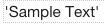

.. image:: ../../images/badges/badge_web.png
   :class: pull-right

Statictext
==========

A **statictext** is a graphical control which displays text that cannot be directly modified by the user. It is not
interactive and does not require any user input. Statictext controls often serve as labels for other controls or to
identify different sections of the View. They can also be used to add context to the user interface.

|

|

Features
--------
* Complete Styling with CSS, CSS Classes or Dynamic Classes
* Dynamic Hide or Show Capabilies
* Easy Tooltip setting and tooltip positionning
* Full set of Events (ie. On Click or Mouse Over, ...)

|

See it in Action
----------------

Try some Sample Statictext controls

.. toctree::
   :maxdepth: 1

   ../../gsguide/samples/sample-statictext

|

Reference
---------

The Statictext control can be set for the following categories of properties:

* :ref:`webgc-text-main-label`
* :ref:`webgc-text-styling-label`
* :ref:`webgc-text-tooltip-label`
* :ref:`webgc-text-events-label`

|

.. _webgc-text-main-label:

.. include:: webgc-properties-main.rst

|

.. _webgc-text-styling-label:

.. include:: webgc-styling.rst

|

.. _webgc-text-tooltip-label:

Tooltip Properties
^^^^^^^^^^^^^^^^^

+------------------------+-------------------+--------------------------------------------------------------------------------------------+
| **Tooltip Properties** | Possible Values   | Description                                                                                |
+========================+===================+============================================================================================+
| Tooltip Text           | Angular expression| Tip to help the user know what to do. It will be displayed when mouse passes over this     |
|                        |                   | control. The Tooltip Text can also be an expression,for example 'this is the tool' + 'TIP' |
|                        |                   | would display in the tooltip *this is the toolTIP*                                         |
+------------------------+-------------------+--------------------------------------------------------------------------------------------+
| Tooltip Direction      | Left, Top,        | A radio button is provided with the values Left, Top, Bottom or Right corresponding to the |
|                        | Bottom, Right     | position where the tooltip will be displayed relative to the text.                         |
|                        |                   |                                                                                            |
|                        |                   |   .. image:: ../../images/gcs/web/wgc-statictext-tooltip-direction.png                     |
+------------------------+-------------------+--------------------------------------------------------------------------------------------+
| Style                  | CSS syles         | CSS style attribure(s) to use for this component, separated by semi-colons, for example:   |
|                        |                   | *color:red; background-color:lightgray*. By clicking on the **...** on the right hand side |
|                        |                   | of the field, a window opens up proposing to change attributes for **font**, **color**,    |
|                        |                   | **padding** and **margin** presented in a tree. When clicking on the arrow to the left of  |
|                        |                   | the attribute type, the user is guide by placeholder to enter the correct settings         |
|                        |                   |                                                                                            |
|                        |                   |        .. image:: ../../images/gcs/dfx-styles-editor.png                                   |
|                        |                   |           :width: 450px                                                                    |
+------------------------+-------------------+--------------------------------------------------------------------------------------------+
| Class                  | CSS class         | Name of CSS class to use for the component.                                                |
+------------------------+-------------------+--------------------------------------------------------------------------------------------+

|

.. _webgc-text-events-label:

.. include:: webgc-events.rst

|

Return to the `Documentation Home <http://localhost:63342/dfd/build/index.html>`_.

|
