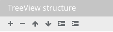

.. image:: ../../images/badges/badge_web.png
   :class: pull-right

Treeview
========

.. image:: ../../images/icons/basic_treeview.png
    :width: 50px
    :height: 50px

A treeview is a graphical control that presents information in a hierarchical view. Each item (often referred to
as a branch or a node) can have a number of subitems or children. The subitems or children are often visualized by indentation
in a list showing that they are sub-categories of the parent node. Items can be expanded to show subitems and
collapsed to hide subitems.

An example of a Treeview that most people are familiar with is file directories with folders, sub-folers and individual
files allowing users to organize and easily find files.

|

.. image:: ../../images/gcs/web/webgc-treeview.png

|

Features
--------
* Feature 1
* Feature 2
* Feature 3
* Feature 4

|

See it in Action
----------------

Try the Sample Treeviews

.. toctree::
   :maxdepth: 1

   ../../gsguide/samples/sample-treeviews

|

Reference
---------

The Treeview control properties can be set for the following property categories:

* :ref:`webgc-treeview-edit-label`
* :ref:`webgc-treeview-styling-label`
* :ref:`webgc-treeview-events-label`

|

Main Properties
^^^^^^^^^^^^^^

.. toctree::
   :maxdepth: 1

   webgc-prop-main-id
   webgc-prop-main-template
   webgc-prop-main-name
   webgc-prop-main-label
   webgc-prop-main-icon
   webgc-prop-main-display
   webgc-prop-main-disable

|

Styling Properties
^^^^^^^^^^^^^^^^^^^

.. toctree::
   :maxdepth: 1

   webgc-prop-style-style
   webgc-prop-style-class
   webgc-prop-style-dynamic

|

+------------------------+-------------------+--------------------------------------------------------------------------------------------+
| **Main Properties**    | Possible Values   | Description                                                                                |
+========================+===================+============================================================================================+
| TreeView Items         | Treeview Items    | Clicking on .. image:: ../../images/gcs/web/wgc-edit-option.png will open the Treeview     |
|                        |                   | Items editor (see :ref:`webgc-treeview-edit-label` below.                                  |
+------------------------+-------------------+--------------------------------------------------------------------------------------------+
| Selected Items         | template name     | Name of the template to be used as the basis of the current Statictext control.            |
|                        |                   | For more information on how to use Templates see :ref:`dfx-templates-label`                |
+------------------------+-------------------+--------------------------------------------------------------------------------------------+

|

.. _webgc-treeview-edit-label:

Treeview Items Editor
^^^^^^^^^^^^^^^^^^^^

The Treeview Items editor is reached by clicking on the edit option in the Main Propertiex

.. image:: ../../images/gcs/web/wgc-treeview-edit.png

The Treeview Items Editor is a visual editor that  helps the developer to quickly create treeview items and organize them
in the correct hierarchy or structure.

.. image:: ../../images/gcs/web/wgc-treeview-editor.png

You can create Static or Dynamic treeviews.

|

Static Options
''''''''''''''

The static treeview is created by adding items and giving them a hierarchy using the action icons in the *Treeview structure* section.

**Treeview Structure**

|

|

* To create a new item just click on the **+** sign and edit the label.
* To remove an item click on the **-** sign and the item will be removed.
* To move an item up in the list, click on the up arrow action icon.
* To move an item down in the list, click on the down arrow action icon.
* To indent an item making it a sub category of the previous item click on the indent icon.
* To unindent an item brining it up a level in the hierarchy click on the unindent action icon.

|

**Treeview Item Properties**

.. image:: ../../images/gcs/web/wgc-treeview-editor-properties.png

Treeview item properties are set in the Treeview Properies section. Ther you can define the label for each treeview item.
Item labels are Angular expressions and can thus use any allowed angular expression. Click on the *...** and a Expression
Editor will be displayed. See :ref:`angular-expression-label` for more help. Text that is not surrounded by quotes will
be interpreted as a variable.

Dynamic Options
'''''''''''''''

Dynamic treeviews gets its content from a variable source.

|

.. _webgc-treeview-styling-label:

Styling Attributes
^^^^^^^^^^^^^^^^^

+------------------------+-------------------+--------------------------------------------------------------------------------------------+
| **Styling Attributes** | Possible Values   | Description                                                                                |
+========================+===================+============================================================================================+
| Flex Width             | Value 1 to 100    | Slider that sets the width of the treeview.                                                |
|                        |                   |                                                                                            |
|                        |                   |        .. image:: ../../images/gcs/web/wgc-treeview-flexwidth.png                          |
+------------------------+-------------------+--------------------------------------------------------------------------------------------+
| Icon if Opened         | Icon name         | Name of icon to be displayed when tree menu is opened, for example 'fa-minus.              |
|                        |                   |                                                                                            |
|                        |                   |        .. image:: ../../images/gcs/web/wgc-treeview-opened-icon.png                        |
|                        |                   |                                                                                            |
|                        |                   | Which would look like row 2 in this example, incating that the tree list is expanded or    |
|                        |                   | opened.                                                                                    |
|                        |                   |        .. image:: ../../images/gcs/web/webgc-treeview.png                                  |
+------------------------+-------------------+--------------------------------------------------------------------------------------------+
| Icon if Closed         | Icon name         | Name of icon to be displayed when tree menu is opened, for example 'fa-plus'.              |
|                        |                   |                                                                                            |
|                        |                   |        .. image::  ../../images/gcs/web/wgc-treeview-closed-icon.png                       |
|                        |                   |                                                                                            |
|                        |                   | Which would look like row 1 in this example, incating that the tree list is contracted or  |
|                        |                   | closed.                                                                                    |
|                        |                   |        .. image:: ../../images/gcs/web/webgc-treeview.png                                  |
+------------------------+-------------------+--------------------------------------------------------------------------------------------+
| Icon Color             | CSS color         | This can either be a hex value or one of the *Color Names Supported by All Browsers*       |
|                        |                   | for example:  #d64626 or **orange** would change the the Treeview icon to the color Orange.|
|                        |                   |                                                                                            |
|                        |                   |        .. image:: ../../images/gcs/web/wgc-treeview-orange-icon.png                        |
+------------------------+-------------------+--------------------------------------------------------------------------------------------+
| Style                  | CSS syles         | CSS style attribure(s) to use for this component, separated by semi-colons, for example:   |
|                        |                   | *color:red; background-color:lightgray*. By clicking on the **...** on the right hand side |
|                        |                   | of the field, a window opens up proposing to change attributes for **font**, **color**,    |
|                        |                   | **padding** and **margin** presented in a tree. When clicking on the arrow to the left of  |
|                        |                   | the attribute type, the user is guide by placeholder to enter the correct settings         |
|                        |                   |                                                                                            |
|                        |                   |        .. image:: ../../images/gcs/dfx-help-css-styles.png                                 |
+------------------------+-------------------+--------------------------------------------------------------------------------------------+
| Class                  | CSS class         | Name of CSS class to use for the component.                                                |
+------------------------+-------------------+--------------------------------------------------------------------------------------------+
| Dynamic Class          | CSS Class         | The Dynamic Class is a CSS class that will be added to the graphical control if an Angular |
|                        |                   | Expression is verified. It is rendered as a ng-class attribute.                            |
+------------------------+-------------------+--------------------------------------------------------------------------------------------+

|

.. _webgc-treeview-events-label:

.. include:: webgc-events.rst

|

How to create a treeview
^^^^^^^^^^^^^^^^^^^^^^^

The TreeView Graphical Control can be bound to a JSON.  The JSON can have a repetitive child property:

Ex: a directory structure
[{
    "name": "’default’",
    "children": [{
        "name": "’products’",
        "children": [
            { "name": "’Printers’",
  "children": [
    { “name”: “‘Canon’” },
    { “name”: “‘HP’” },
    { “name”: “‘Samsung’” }
] },
            { "name": "’Scanners’",
 "children": [] }
        ]
    }]
}]

TreeView can be static/dynamic. Dynamic representation has higher priority then static.
Static representation
Static representation can be build with popup dialog window like GC Iconbar/Fab/Treemenu. In popup window we can set labels for each item. Labels are expressions.
Dynamic representation
It can work with json object of different structure. Need to put three parameters into TreeView items section fields of Property Panel:
Dynamic - it is name of scope array;
Repeatable Property - name of repeatable scope array property;
Label - name of property that will be TreeView item label.

Example:

$scope.treeview = [{
    "asd": "'default ' + symbol",
    "quantity": "'045'",
    "url": "http://google.com.ua",
    "qwe": [
      {
        "asd": "'products'",
        "qwe": [
          {
            "asd": "'Printers'",
            "qwe": []
          }
        ]
      }
    ]
  }]

To bind it to GC TreeView we need set in Property Panel:
Dynamic - treeview;
Repeatable Property - qwe;
Label - asd.

GC TreeView has special 3 styling properties:
Icon if Opened ( expression, default: ‘fa-minus’ ) - it is icon for item which is “opened/expanded” (when children are displayed);
Icon if Closed ( expression, default: ‘fa-plus’ ) - it is icon for item which is “closed/collapsed” (when children are hided);
Icon color ( css color value ) - it is icons color.
Icons can be changed in popup window or as a scope variable.
For example, for “opened” in popup window select ‘fa-folder-open’ and for “closed” - ‘fa-folder’, Icon color - green.

Those icons are clickable and can only expande/collapse item children.

To Each GC TreeView item we can connect events from Property Panel.

For example we have simple function in scope:

$scope.clickedItem = function(item) {
	console.log(item);
};
And we put into ‘On Double click’ field: selectNode($dfx_item).
As a result in console we will see our doubleClicked item ( an object with all his properties  ).

+----------------------------------------------------------------------------------------+-------------------------------------------------------+
| **Step Descriptions**                                                                  | Screen                                                |
+========================================================================================+=======================================================+
| Drag and drop Treemenu GC to the working area, click on GC and then                    | .. figure:: ../../images/gcs/dfx-help-css-styles.png  |
| open Menu editor in popup by cliking Edit button in Property Panel.                    |     :width: 150px                                     |
| You’ll see default item: ‘Home’                                                        |     :height: 75px                                     |
+----------------------------------------------------------------------------------------+-------------------------------------------------------+

Return to the `Documentation Home <http://localhost:63342/dfd/build/index.html>`_.

|
