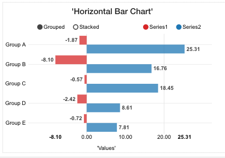

.. image:: ../../images/badges/badge_web.png
   :class: pull-right

Horizontal Barchart
===================

The pre-defined Line Charts graphical controls available in the View Editor are based on NDV3 library.

|

|

See it in Action
----------------

* `Try some Horizontal Bar Chart Samples <http://dfbluemixsrv02.market-interactive-clouds.com/studio/widget/web/Samples/welcome1/index.html>`_
* Download Samples from Github

|

Reference
---------

The Horizontal Barchart control properties can be set for the following property categories:

* :ref:`webgc-hzbarchart-options-label`
* :ref:`webgc-hzbarchart-render-label`
* :ref:`webgc-hzbarchart-styling-label`
* :ref:`webgc-hzbarchart-events-label`

|

Main Properties
^^^^^^^^^^^^^^

.. toctree::
   :maxdepth: 1

   webgc-prop-main-id
   webgc-prop-main-template
   webgc-prop-main-name
   webgc-prop-main-label
   webgc-prop-main-icon
   webgc-prop-main-display
   webgc-prop-main-disabled

|

Styling Attributes
^^^^^^^^^^^^^^^^^^

.. toctree::
   :maxdepth: 1

   webgc-prop-style-style
   webgc-prop-style-class
   webgc-prop-style-dynamic

|

+------------------------+-------------------+--------------------------------------------------------------------------------------------+
| Main Properties        | Possible Values   | Description                                                                                |
+========================+===================+============================================================================================+
| Name                   | hzBarChart#       | Name is a reference to the component's DOM element. It can be used to dynamically access   |
|                        |                   | and set component properties. DreamFace gives a default name of *linneChart#* where #      |
|                        |                   | corresponds to the order in which it was created. If it's the second control created it    |
|                        |                   | will have a default Name of *hzBarChart2*. Name is not required and can be removed if not  |
|                        |                   | needed.                                                                                    |
+------------------------+-------------------+--------------------------------------------------------------------------------------------+
| Binding                | $scope variable   | The data table can be bound to a value contained in a $scope variable.                     |
|                        |                   |                                                                                            |
+------------------------+-------------------+--------------------------------------------------------------------------------------------+
|Title                   | Any text          | Title of the table, this can either be text in quotes or an                                |
|                        | Angular Expression| :ref:`angular-expression-label`.                                                           |
|                        |                   |                                                                                            |
+------------------------+-------------------+--------------------------------------------------------------------------------------------+
| Display                | *true* or *false* | The value can be a literal **true** to display the component or **false** to hide it. This |
|                        | Angular Expression| value can also be the result of an :ref:`angular-expression-label` that returns a boolean  |
|                        |                   | value of the true or false, *true* meaning it will be visible, *false* meaning it will not |
|                        |                   | be displayed.                                                                              |
+------------------------+-------------------+--------------------------------------------------------------------------------------------+

|

.. _webgc-hzbarchart-options-label:

Options
^^^^^^

+------------------------+-------------------+--------------------------------------------------------------------------------------------+
| **Optionss**           | Possible Values   | Description                                                                                |
+========================+===================+============================================================================================+
| X-Axis Label           | Any text          | Title of the table, this can either be text in quotes or an :ref:`angular-expression-label`|
+------------------------+-------------------+--------------------------------------------------------------------------------------------+
| Y-Axis Lable           | Any text          | Title of the table, this can either be text in quotes or an :ref:`angular-expression-label`|
+------------------------+-------------------+--------------------------------------------------------------------------------------------+
|

.. _webgc-hzbarchart-render-label:

Rendering
^^^^^^^^^

This is the rendering section.

|

.. _webgc-hzbarchart-styling-label:

Styling Attributes
^^^^^^^^^^^^^^^^^^

+------------------------+-------------------+--------------------------------------------------------------------------------------------+
| **Styling Attributes** | Possible Values   | Description                                                                                |
+========================+===================+============================================================================================+
| Size                   | size in dp        | Choose the size of the icon from the dropdown list by clicking on the drop arrow on the    |
|                        |                   | right of the size field.                                                                   |
+------------------------+-------------------+--------------------------------------------------------------------------------------------+
| Color                  | CSS color         | #hexcode for color| CSS colors are defined using a hexadecimal (HEX) notation              |
|                        | Predefined Cross- | (see :term:`Hexadecimal Colors`) or enter one of the Pre-defined cross browser colors.     |
|                        | Browser Colors    | `140 cross browser colors <http://www.w3schools.com/cssref/css_colornames.asp>`_           |
+------------------------+-------------------+--------------------------------------------------------------------------------------------+
| Class                  | CSS class         | Name of CSS class to use for the component.                                                |
+------------------------+-------------------+--------------------------------------------------------------------------------------------+
| Dynamic Classes        | CSS Class         | The Dynamic Class is a CSS class that will be added to the graphical control if an Angular |
|                        |                   | Expression is verified. It is rendered as a ng-class attribute.                            |
+------------------------+-------------------+--------------------------------------------------------------------------------------------+
| Width                  | number of pixels  | Then number of pixels of the width of the Chart The defautl is 300px                       |
|                        |       n*px*       |                                                                                            |
+------------------------+-------------------+--------------------------------------------------------------------------------------------+
| Height                 | number of pixels  | Then number of pixels of the height of the Chart The defautl is 250px                      |
|                        |       n*px*       |                                                                                            |
+------------------------+-------------------+--------------------------------------------------------------------------------------------+

|

.. _webgc-hzbarchart-events-label:

.. include:: webgc-events-state.rst

Return to the `Documentation Home <http://localhost:63342/dfd/build/index.html>`_.

|