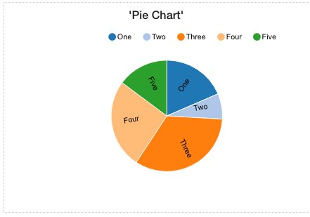

Piechart
========

The pre-defined Charts graphical controls available in the Widget Editor are based on NDV3 library.
|

|

See it in Action
----------------

* `Try some Pie Chart Samples <http://dfbluemixsrv02.market-interactive-clouds.com/studio/widget/web/Samples/welcome1/index.html>`_
* Download Samples from Github

|

Reference
---------

The Linechart control properties can be set for the following property categories:

* :ref:`webgc-piechart-render-label`
* :ref:`webgc-piechart-styling-label`
* :ref:`webgc-piechart-events-label`

|

Main Properties
^^^^^^^^^^^^^^

.. toctree::
   :maxdepth: 1

   webgc-prop-main-id
   webgc-prop-main-template
   webgc-prop-main-name
   webgc-prop-main-label
   webgc-prop-main-icon
   webgc-prop-main-display
   webgc-prop-main-disabled

|

Styling Attributes
^^^^^^^^^^^^^^^^^^

.. toctree::
   :maxdepth: 1

   webgc-prop-style-style
   webgc-prop-style-class
   webgc-prop-style-dynamic

|

+------------------------+-------------------+--------------------------------------------------------------------------------------------+
| **Main Properties**    | Possible Values   | Description                                                                                |
+========================+===================+============================================================================================+
| Name                   | pieChart#         | Name is a reference to the component's DOM element. It can be used to dynamically access   |
|                        |                   | and set component properties. DreamFace gives a default name of *pieChart#* where #        |
|                        |                   | corresponds to the order in which it was created. If it's the second control created it    |
|                        |                   | will have a default Name of *pieChart2*. Name is not required and can be removed if not    |
|                        |                   | needed.                                                                                    |
+------------------------+-------------------+--------------------------------------------------------------------------------------------+
| Label                  | *text*            |                                                                                            |
+------------------------+-------------------+--------------------------------------------------------------------------------------------+
| Label Visible          | *text*            | Text that will be displayed in the label of the field. Text can also be an expression.     |
+------------------------+-------------------+--------------------------------------------------------------------------------------------+
| Label Visible          | *yes*, *no*       | Specifies if the label is visible or not.                                                  |
+------------------------+-------------------+--------------------------------------------------------------------------------------------+
| Tooltips               | Any text          | Tip to help the user. It will be displayed when mouse passes over this control. Tooltip    |
|                        |                   | text can also be an expression.                                                            |
+------------------------+-------------------+--------------------------------------------------------------------------------------------+
| Type                   |                   |                                                                                            |
+------------------------+-------------------+--------------------------------------------------------------------------------------------+
| Labels for Data Points |                   |                                                                                            |
+------------------------+-------------------+--------------------------------------------------------------------------------------------+
| Inner Radius (Pie      |                   |                                                                                            |
| Charts                 |                   |                                                                                            |
+------------------------+-------------------+--------------------------------------------------------------------------------------------+
| Legend Visible         |                   |                                                                                            |
+------------------------+-------------------+--------------------------------------------------------------------------------------------+
| Legend Position        |                   |                                                                                            |
+------------------------+-------------------+--------------------------------------------------------------------------------------------+
|

.. _webgc-piechart-render-label:

Rendering
^^^^^^^^^

This is the rendering section.

|

.. _webgc-piechart-styling-label:

Styling Attributes
^^^^^^^^^^^^^^^^^^

+------------------------+-------------------+--------------------------------------------------------------------------------------------+
| **Styling Attributes** | Possible Values   | Description                                                                                |
+========================+===================+============================================================================================+
| Size                   | size in dp        | Choose the size of the icon from the dropdown list by clicking on the drop arrow on the    |
|                        |                   | right of the size field.                                                                   |
+------------------------+-------------------+--------------------------------------------------------------------------------------------+
| Color                  | CSS color         | #hexcode for color| CSS colors are defined using a hexadecimal (HEX) notation              |
|                        | Predefined Cross- | (see :term:`Hexadecimal Colors`) or enter one of the Pre-defined cross browser colors.     |
|                        | Browser Colors    | `140 cross browser colors <http://www.w3schools.com/cssref/css_colornames.asp>`_           |
+------------------------+-------------------+--------------------------------------------------------------------------------------------+
| Classes                | CSS class         | Name of CSS class to use for the component.                                                |
+------------------------+-------------------+--------------------------------------------------------------------------------------------+
| Dynamic Classes        | CSS Class         | The Dynamic Class is a CSS class that will be added to the graphical control if an Angular |
|                        |                   | Expression is verified. It is rendered as a ng-class attribute.                            |
+------------------------+-------------------+--------------------------------------------------------------------------------------------+

|

.. _webgc-piechart-events-label:

.. include:: webgc-events-state.rst

Return to the `Documentation Home <http://localhost:63342/dfd/build/index.html>`_.

|