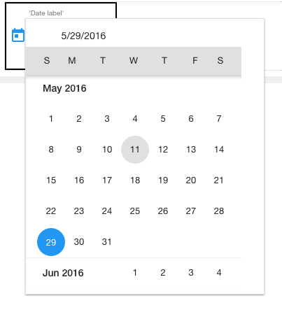

.. image:: ../../images/badges/badge_web.png
   :class: pull-right

Datepicker
==========

The datepicker is a standard input field tied to an interactive overlay calendar component that assists the user in entering a valid
date for a date field. The user can select and validate a date from a overlay calendar and that value will be copied to the field.

|

|

|

Features
--------
* Feature 1
* Feature 2
* Feature 3
* Feature 4

|

See it in Action
----------------

* `Try some Areachart Samples <http://dfbluemixsrv02.market-interactive-clouds.com/studio/widget/web/Samples/welcome1/index.html>`_
* Download Samples from Github

|

Reference
---------

The Date Picker control properties can be set for the following property categories:

* :ref:`webgc-datepicker-main-label`
* :ref:`webgc-datepicker-render-label`
* :ref:`webgc-datepicker-styling-label`
* :ref:`webgc-datepicker-events-label`

|

.. _webgc-datepicker-main-label:

Main Properties
---------------

|

+------------------------+-------------------+--------------------------------------------------------------------------------------------+
| **Main Properties**    | Possible Values   | Description                                                                                |
+========================+===================+============================================================================================+
| Name                   | dtField#          | Name is a reference to the component's DOM element. It can be used to dynamically access   |
|                        |                   | and set component properties. DreamFace gives a default name of *dtField#* where #         |
|                        |                   | corresponds to the order in which the control was created. If it's the second datepicker   |
|                        |                   | created it will have a default Name of *dtField2*. Name is not required and can be removed |
|                        |                   | if not needed.                                                                             |
+------------------------+-------------------+--------------------------------------------------------------------------------------------+
| Binding                | Any text          | The HTML control can be bound to data coming from a service, for example a service that    |
|                        |                   | goes to a content management system. Text that will be displayed in the field.             |
|                        |                   |                                                                                            |
+------------------------+-------------------+--------------------------------------------------------------------------------------------+
| label                  | Any text          | This is the text that will appear above the date field to indicate to the user what date   |
|                        |                   | is being entered.                                                                          |
|                        |                   |                                                                                            |
+------------------------+-------------------+--------------------------------------------------------------------------------------------+
| type                   | standard          | Click on the **...** to the right of the field to select one of the favicons from the list.|
|                        | ranged            |                                                                                            |
+------------------------+-------------------+--------------------------------------------------------------------------------------------+
| required               | *true* or *false* | *true* to display the field or *false* to hide it. The value true or false is chosen from  |
|                        |                   | from a dropdown list by clicking on the arrow on the right side of the field.              |
|                        |                   |                                                                                            |
+------------------------+-------------------+--------------------------------------------------------------------------------------------+
| Display                | *true* or *false* | The value can either be a literal *true* to display the field or *false* to hide it, or it |
|                        | angular expression| be a angular expression that evaulates to *true* or *false*, for example,                  |
|                        |                   |                                                                                            |
|                        |                   | 5 > 2 would evaluate to *true* and 5 < 2 would evaluate to false                           |
+------------------------+-------------------+--------------------------------------------------------------------------------------------+
| Disabled               | *true* or *false* | *true* to disable the field or *false* to make it active or it be a angular expression that|
|                        | angular expression| evaulates to *true* or *false*, for example,                                               |
|                        |                   |                                                                                            |
|                        |                   | 5 > 2 would evaluate to *true* and 5 < 2 would evaluate to false                           |
|                        |                   |                                                                                            |
+------------------------+-------------------+--------------------------------------------------------------------------------------------+

|

.. _webgc-datepicker-render-label:

Rendering
^^^^^^^^^

This is the rendering section.

|

.. _webgc-datepicker-styling-label:

Styling Attributes
------------------

+------------------------+-------------------+--------------------------------------------------------------------------------------------+
| **Styling Attributes** | Possible Values   | Description                                                                                |
+========================+===================+============================================================================================+
| Size                   | size in dp        | Choose the size of the icon from the dropdown list by clicking on the drop arrow on the    |
|                        |                   | right of the size field.                                                                   |
+------------------------+-------------------+--------------------------------------------------------------------------------------------+
| Color                  | CSS color         | #hexcode for color  CSS colors are defined using a hexadecimal (HEX) notation (see         |
|                        | Predefined Cross- | :term:`Hexadecimal Colors` ) or enter one of the Pre-defined cross browser colors:         |
|                        | Browser Colors    | `140 cross browser colors <http://www.w3schools.com/cssref/css_colornames.asp>`_           |
+------------------------+-------------------+--------------------------------------------------------------------------------------------+
| Style                  | CSS syles         | By clicking on the **...** on the right h                                                  |
+------------------------+-------------------+--------------------------------------------------------------------------------------------+
| Classes                | CSS class         | Name of CSS class to use for the component.                                                |
+------------------------+-------------------+--------------------------------------------------------------------------------------------+
| Dynamic Classes        | CSS Class         | The Dynamic Class is a CSS class that will be added to the graphical control if an Angular |
|                        |                   | Expression is verified. It is rendered as a ng-class attribute.                            |
+------------------------+-------------------+--------------------------------------------------------------------------------------------+

|

.. _webgc-datepicker-events-label:

.. include:: webgc-props-events-onchange.rst

Return to the `Documentation Home <http://localhost:63342/dfd/build/index.html>`_.

|

