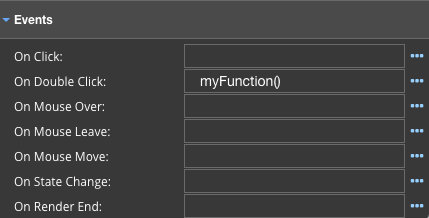

Events
^^^^^^

Events allow developers to perform actions when the event is triggered on a control in the View.
Events are used in combination with functions. The function is executed when the the event occurs (for example, when a
user clicks a button, when the mouse moves over the control, ..).

   Each of the events takes a function name that will be executed when the user invokes the event. In the example above
   the function named *myFunction* will be executed on the *On Double Click* event.

Functions called in a View are defined in the view controller in the script of the View. Clicking on the ... opens a window
providing the current list of functions that are available to be used from the View.

|

+------------------+-----------------+----------------------------------------------------------------------------------------------------+
| **Events**       | Possible Values | Description                                                                                        |
+==================+=================+====================================================================================================+
| On Click:        | *function name* | The function is executed when the user clicks on the control triggering the On Click event.        |
+------------------+-----------------+----------------------------------------------------------------------------------------------------+
| On Double Click: | *Function Name* | The function is executed when the user double clicks on the control triggering the On Double Click |
|                  |                 | event.                                                                                             |
+------------------+-----------------+----------------------------------------------------------------------------------------------------+
| On Mouse Over:   | *Function Name* | The function is executed when the user passes the mouse over the control.                          |
+------------------+-----------------+----------------------------------------------------------------------------------------------------+
| On Mouse Move:   | *Function Name* | The function is executed when the mouse is moving while it is over the control.                    |
+------------------+-----------------+----------------------------------------------------------------------------------------------------+
| On Mouse Leave:  | *Function Name* | The function is executed when the mouse is moved out of the control.                               |
+------------------+-----------------+----------------------------------------------------------------------------------------------------+
| On Before Update:| *Function Name* | The function is executed before updating ???                                                       |
+------------------+-----------------+----------------------------------------------------------------------------------------------------+
| On Render End:   | *Function Name* | The *Mouse Up* event occurs when the mouse is released over the control which triggers the function|
|                  |                 | to be executed.                                                                                    |
+------------------+-----------------+----------------------------------------------------------------------------------------------------+

|