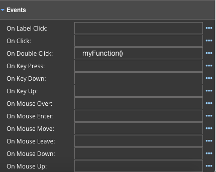

Events
^^^^^^

Events allow developers to perform actions when the event is triggered on a control in the View.
Events are used in combination with functions. The function is executed when the the event occurs (for example, when a
user clicks a button, when the mouse moves over the control, ..).

   Each of the events takes a function name that will be executed when the user invokes the event. In the example above
   the function named *myFunction* will be executed on the *On Double Click* event.

Functions called in a View are defined in the view controller in the script of the View. Clicking on the ... opens a window
providing the current list of functions that are available to be used from the View.

|

+------------------+-----------------+----------------------------------------------------------------------------------------------------+
| **Events**       | Possible Values | Description                                                                                        |
+==================+=================+====================================================================================================+
| On Label Click:  | *Function call* | The function is executed when the user clicks on the label of the control.                         |
+------------------+-----------------+----------------------------------------------------------------------------------------------------+
| On Click:        | *Function call* | The function is executed when the user clicks on the control.                                      |
+------------------+-----------------+----------------------------------------------------------------------------------------------------+
| On Double Click: | *Function call* | The function is executed when the user double clicks on the control.                               |
+------------------+-----------------+----------------------------------------------------------------------------------------------------+
| On Key Press:    | *Function call* | The function is executed when the user presses a key while focus is on the control.                |
+------------------+-----------------+----------------------------------------------------------------------------------------------------+
| On Key Down:     | *Function call* | The function is executed when the user holds the key down (on the keyboard).                       |
+------------------+-----------------+----------------------------------------------------------------------------------------------------+
| On Key Up:       | *Function call* | The function is triggered when the user releases a key (on the keyboard).                          |
+------------------+-----------------+----------------------------------------------------------------------------------------------------+
| On Mouse Over:   | *Function call* | The function is executed when the user passes the mouse over the control.                          |
+------------------+-----------------+----------------------------------------------------------------------------------------------------+
| On Mouse Enter:  | *Function call* | The function is executed when the the mouse is over or enters the selected control.                |
|                  |                 | *Note:* unlike the Mouse Over event, this event only triggers when the mouse enters the selected   |
|                  |                 | control. The  Mouse Over event is triggered if a mouse pointer enters any child elements as well.  |
+------------------+-----------------+----------------------------------------------------------------------------------------------------+
| On Mouse Move:   | *Function call* | The function is executed when the mouse is moving while it is over the control.                    |
+------------------+-----------------+----------------------------------------------------------------------------------------------------+
| On Mouse Leave:  | *Function call* | The function is executed when the mouse is moved out of the control.                               |
+------------------+-----------------+----------------------------------------------------------------------------------------------------+
| On Mouse Down:   | *Function call* | The function is executed when the user presses a mouse button over the control.                    |
+------------------+-----------------+----------------------------------------------------------------------------------------------------+
| On Mouse Up:     | *Function call* | The *Mouse Up* event occurs when the mouse is released over the control which triggers the function|
|                  |                 | to be executed.                                                                                    |
+------------------+-----------------+----------------------------------------------------------------------------------------------------+
