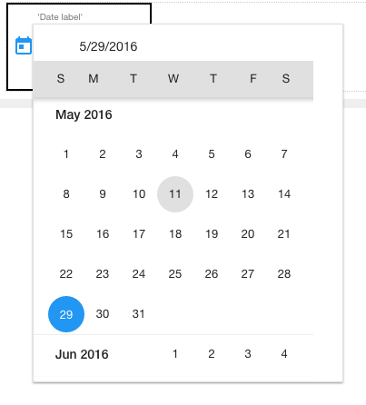

.. image:: ../../images/badges/badge_web.png
   :class: pull-right

Datepicker
==========

The datepicker is a standard input field tied to an interactive overlay calendar component that assists the user in entering a valid
date for a date field. The user can select and validate a date from a overlay calendar and that value will be copied to the field.

|

|

See it in Action
----------------

Try the Sample Buttons

.. toctree::
   :maxdepth: 1

   ../../gsguide/samples/sample-datepicker

    |

|

Reference
---------

The Date Picker control properties can be set for the following property categories:

Main Properties
^^^^^^^^^^^^^^

.. toctree::
   :maxdepth: 1

   webgc-prop-main-id
   webgc-prop-main-template
   webgc-prop-main-name
   webgc-prop-main-binding
   webgc-prop-main-label
   webgc-prop-main-type
   webgc-prop-main-display
   webgc-prop-main-disabled

|

Styling Attributes
^^^^^^^^^^^^^^^^^^

.. toctree::
   :maxdepth: 1

   webgc-prop-style-flexwidth
   webgc-prop-style-alignment
   webgc-prop-style-style
   webgc-prop-style-class
   webgc-prop-style-dynamic

|

Validation Properties
^^^^^^^^^^^^^^^^^^^^^
* Required
* Range messages

Events
^^^^^^

.. toctree::
   :maxdepth: 1

   webgc-events-onchange.rst

Return to the `Documentation Home <http://localhost:63342/dfd/build/index.html>`_.

|

