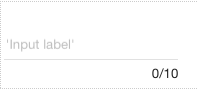

.. image:: ../../images/badges/badge_web.png
   :class: pull-right

Input
=====

The Input graphical control is a single-line input field where users can enter data.

|

|

Input Reference
---------------

The Input Field control properties can be set for the following property categories:

Main Properties
^^^^^^^^^^^^^^

.. toctree::
   :maxdepth: 1

   webgc-prop-main-id
   webgc-prop-main-template
   webgc-prop-main-name
   webgc-prop-main-binding
   webgc-prop-main-label
   webgc-prop-main-icon
   webgc-prop-main-icon-position
   webgc-prop-main-input-type
   webgc-prop-main-display
   webgc-prop-main-disabled

|

Validation Properties
^^^^^^^^^^^^^^^^^^^^^

.. toctree::
   :maxdepth: 1

   webgc-prop-validation

|

Styling Attributes
^^^^^^^^^^^^^^^^^^

Container Stying
''''''''''''''''

.. toctree::
   :maxdepth: 1

   webgc-prop-style-style
   webgc-prop-style-class
   webgc-prop-style-dynamic

|

Icon Styling
''''''''''''

.. toctree::
   :maxdepth: 1

   webgc-prop-style-iconsize
   webgc-prop-style-iconstyle
   webgc-prop-style-iconclass
   webgc-prop-style-dynamic

|

Events
^^^^^^

.. toctree::
   :maxdepth: 1

   webgc-events-onchange.rst

|

See it in Action
----------------

Try the Sample Input controls

.. toctree::
   :maxdepth: 1

   ../../gsguide/samples/sample-input

|

Return to the `Documentation Home <http://localhost:63342/dfd/build/index.html>`_.
