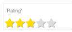

.. image:: ../../images/badges/badge_web.png
   :class: pull-right

Rating
======

Rating controls allow users to rate or give an appreciation to something by selecting a number of icons from fixed number
of icons, often presented as stars.

|

|

See it in Action
----------------

Try the Sample Buttons

.. toctree::
   :maxdepth: 1

   ../../gsguide/samples/sample-rating

    |

|

Reference
---------

The Rating control properties can be set for the following property categories:

Main Properties
^^^^^^^^^^^^^^

.. toctree::
   :maxdepth: 1

   webgc-prop-main-id
   webgc-prop-main-template
   webgc-prop-main-name
   webgc-prop-main-binding
   webgc-prop-main-label
   webgc-prop-main-maxval
   webgc-prop-main-range
   webgc-prop-main-icon
   webgc-prop-main-display
   webgc-prop-main-disabled

|

Styling Attributes
^^^^^^^^^^^^^^^^^^

.. toctree::
   :maxdepth: 1

   webgc-prop-style-style
   webgc-prop-style-class
   webgc-prop-style-dynamic

|

+------------------------+-------------------+--------------------------------------------------------------------------------------------+
| **Main Properties**    | Possible Values   | Description                                                                                |
+========================+===================+============================================================================================+
+------------------------+-------------------+--------------------------------------------------------------------------------------------+
| Range                  | number            |                        |
+------------------------+-------------------+--------------------------------------------------------------------------------------------+
|

Styling Attributes
^^^^^^^^^^^^^^^^^^

+------------------------+-------------------+--------------------------------------------------------------------------------------------+
| **Styling Attributes** | Possible Values   | Description                                                                                |
+========================+===================+============================================================================================+
| Normal Color           | CSS syles         | CSS style attribure(s) to use for this component, separated by semi-colons, for example:   |
|                        |                   | *color:red; background-color:lightgray*.                                                   |
+------------------------+-------------------+--------------------------------------------------------------------------------------------+
| Hilighted Color        | CSS syles         | CSS style attribure(s) to use for this component, separated by semi-colons, for example:   |
|                        |                   | *color:red; background-color:lightgray*.                                                   |
+------------------------+-------------------+--------------------------------------------------------------------------------------------+

|

Events
^^^^^^

.. toctree::
   :maxdepth: 1

   webgc-events-rating.rst

|

Return to the `Documentation Home <http://localhost:63342/dfd/build/index.html>`_.

|