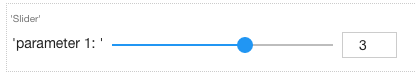

.. image:: ../../images/badges/badge_web.png
   :class: pull-right

Slider
======

The slider is a horizontal bar control used to change and set a value by sliding a handle along a range of values,
for example it could slide between 0 and 100. When the user slides the handle and stops that is the value of the field.

|

|

Detailed Slider Reference
-------------------------

The Slider control properties can be set for the following property categories:

Main Properties
^^^^^^^^^^^^^^^

.. toctree::
   :maxdepth: 1

   webgc-prop-main-id
   webgc-prop-main-template
   webgc-prop-main-name
   webgc-prop-main-label
   webgc-prop-main-icon
   webgc-prop-main-display
   webgc-prop-main-disabled

|

Styling Attributes
^^^^^^^^^^^^^^^^^^

Container Styling
'''''''''''''''''

.. toctree::
   :maxdepth: 1

   webgc-prop-style-flexwidth
   webgc-prop-style-style
   webgc-prop-style-class
   webgc-prop-style-dynamic

Label Styling
'''''''''''''

.. toctree::
   :maxdepth: 1

   webgc-prop-style-style
   webgc-prop-style-class

Item Styling
''''''''''''

.. toctree::
   :maxdepth: 1

   webgc-prop-style-style
   webgc-prop-style-class

|

Events
^^^^^^

.. toctree::
   :maxdepth: 1

   webgc-events-onchange.rst

|

See it in Action
----------------

Try the Sample Slider controls

.. toctree::
   :maxdepth: 1

   ../../gsguide/samples/sample-slider

|

Return to the `Documentation Home <http://localhost:63342/dfd/build/index.html>`_.