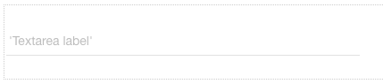

.. image:: ../../images/badges/badge_web.png
   :class: pull-right

Textarea
========

The Textarea graphical control is a multi-line text input control. It can display an icon, can be set to required and can
have a maximum length set.

|

|

See it in Action
----------------

Try the Sample Buttons

.. toctree::
   :maxdepth: 1

   ../../gsguide/samples/sample-textarea

    |

|

Reference
---------

The Textarea Field control properties can be set for the following property categories:

Main Properties
^^^^^^^^^^^^^^

.. toctree::
   :maxdepth: 1

   webgc-prop-main-id
   webgc-prop-main-template
   webgc-prop-main-name
   webgc-prop-main-binding
   webgc-prop-main-label
   webgc-prop-main-icon
   webgc-prop-main-icon-position
   webgc-prop-main-numrows
   webgc-prop-main-display
   webgc-prop-main-disabled

|

Validation Properties
^^^^^^^^^^^^^^^^^^^^^
Coming soon.

|

Styling Attributes
^^^^^^^^^^^^^^^^^^

Container Styling
'''''''''''''''''

.. toctree::
   :maxdepth: 1

   webgc-prop-style-flexwidth
   webgc-prop-style-style
   webgc-prop-style-class
   webgc-prop-style-dynamic

Icon Styling
''''''''''''

.. toctree::
   :maxdepth: 1

   webgc-prop-style-iconsize
   webgc-prop-style-style
   webgc-prop-style-class

|

Events
^^^^^^

.. toctree::
   :maxdepth: 1

   webgc-events-onchange.rst

Return to the `Documentation Home <http://localhost:63342/dfd/build/index.html>`_.

|

