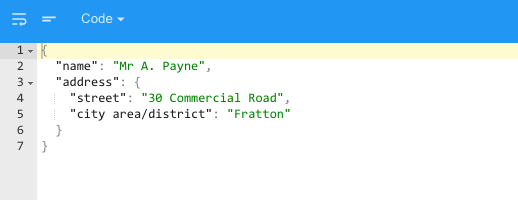

.. image:: ../../images/badges/badge_web.png
   :class: pull-right

JSON
====

The JSON graphical control is a json editor field where users can enter json.

|

|

Features
--------
* Feature 1
* Feature 2
* Feature 3
* Feature 4

|

See it in Action
----------------

* `Try some JSON Samples <http://dfbluemixsrv02.market-interactive-clouds.com/studio/widget/web/Samples/welcome1/index.html>`_
* Download Samples from Github

|

Reference
---------

The Input Field control properties can be set for the following property categories:

* :ref:`webgc-json-main-label`
* :ref:`webgc-json-validation-label`
* :ref:`webgc-json-render-label`
* :ref:`webgc-json-styling-label`
* :ref:`webgc-json-events-label`

|

.. _webgc-json-main-label:

Main Properties
---------------

|

+------------------------+-------------------+--------------------------------------------------------------------------------------------+
| **Main Properties**    | Possible Values   | Description                                                                                |
+========================+===================+============================================================================================+
| Name                   | inpInput#         | Name is a reference to the component's DOM element. It can be used to dynamically access   |
|                        |                   | and set component properties. DreamFace gives a default name of *inpInput#* where #        |
|                        |                   | corresponds to the order in which the control was created. If it's the second input field  |
|                        |                   | created it will have a default Name of *inpInput2*. Name is not required and can be removed|
|                        |                   | if not needed.                                                                             |
+------------------------+-------------------+--------------------------------------------------------------------------------------------+
| label                  | Any text          | This is the text that will appear under the icon, for example the fa-home icon could have  |
|                        |                   | the label Home as DreamFace uses as the default for this component.                        |
+------------------------+-------------------+--------------------------------------------------------------------------------------------+
| icon                   | favicon           | Click on the **...** to the right of the field to select one of the favicons from the list.|
|                        |                   |                                                                                            |
|                        |                   |        .. image:: ../../images/gcs/dfx-icons.png                                           |
+------------------------+-------------------+--------------------------------------------------------------------------------------------+
| Display                | *true* or *false* | The value can either be a literal *true* to display the field or *false* to hide it, or it |
|                        | angular expression| be a angular expression that evaulates to *true* or *false*, for example,                  |
|                        |                   |                                                                                            |
|                        |                   | 5 > 2 would evaluate to *true* and 5 < 2 would evaluate to false                           |
+------------------------+-------------------+--------------------------------------------------------------------------------------------+
| Disabled               | *true* or *false* | *true* to disable the field or *false* to make it active or it be a angular expression that|
|                        | angular expression| evaulates to *true* or *false*, for example,                                               |
|                        |                   |                                                                                            |
|                        |                   | 5 > 2 would evaluate to *true* and 5 < 2 would evaluate to false                           |
|                        |                   |                                                                                            |
+------------------------+-------------------+--------------------------------------------------------------------------------------------+

|

.. _webgc-json-validation-label:

Validation Properties
---------------------

Validation Properties go here

|

.. _webgc-json-render-label:

Rendering
^^^^^^^^^

This is the rendering section.

|

.. _webgc-json-styling-label:

.. include:: webgc-props-styling-slider.rst

|

.. _webgc-json-events-label:

.. include:: webgc-props-events-onchange.rst

Return to the `Documentation Home <http://localhost:63342/dfd/build/index.html>`_.

|