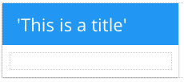

.. image:: ../../images/badges/badge_web.png
   :class: pull-right

Panel
=====

A panel is one of the most important graphical controls in DreamFace because it defines the layout and default style of the
ViewCards. Each ViewCard starts out with a default panel containing a Title, a Toolbar Menu and one row with one column.
A panel is a container which can contain other panels.

Graphical controls that make up the UI can be dragged and dropped into the rows and columns of the layout. The DreamFace
layout is based on the Angular Material and Material Design layout definition of rows and columns. Each row can be independently
defined and can have one or more columns organized in horizontal or vertical layouts. Default CSS styles and classes can
be defined for the panel.

See for more on Angular Material Panel Layouts see `Angular Material Layouts and Containers <https://material.angularjs.org/latest/layout/container>`_

|

|

See it in Action
----------------

Try the Sample Panel controls

.. toctree::
   :maxdepth: 1

   ../../gsguide/samples/sample-panel

|

Reference
---------

The Panel control properties can be set for the following property categories:

|

Main Properties
^^^^^^^^^^^^^^

.. toctree::
   :maxdepth: 1

   webgc-prop-main-id
   webgc-prop-main-template
   webgc-prop-main-name
   webgc-prop-main-whiteframe
   webgc-prop-main-display

|

      |

Repeatable Panel
^^^^^^^^^^^^^^^^

+------------------------+-------------------+--------------------------------------------------------------------------------------------+
| **Repeatable**         | Possible Values   | Description                                                                                |
+========================+===================+============================================================================================+
|Repeat for all $item in | Any text          | Title text or expression defines title of the panel.                                       |
|                        | Angular Expression|                                                                                            |
|                        |                   |                                                                                            |
+------------------------+-------------------+--------------------------------------------------------------------------------------------+

|

Styling Attributes
^^^^^^^^^^^^^^^^^^

.. toctree::
   :maxdepth: 1

   webgc-prop-main-flexwidth
   webgc-prop-style-style
   webgc-prop-style-bodystyle
   webgc-prop-style-class
   webgc-prop-style-dynamic

|

Toolbar Properties
^^^^^^^^^^^^^^^^^^

.. toctree::
   :maxdepth: 1

   webgc-props-toolbar.rst

|

Layout Properties
^^^^^^^^^^^^^^^^^

+------------------------+-------------------+--------------------------------------------------------------------------------------------+
| **Layout Properties**  | Possible Values   | Description                                                                                |
+========================+===================+============================================================================================+
| row #                  | number            | Number of a row in the panel                                                               |
+------------------------+-------------------+--------------------------------------------------------------------------------------------+
| col #                  | number            | Number of a column in the panel                                                            |
+------------------------+-------------------+--------------------------------------------------------------------------------------------+
| width                  | number in pixels  | The width of the column in pixels. Default value is 100px.                                 |
+------------------------+-------------------+--------------------------------------------------------------------------------------------+
| layout direction       | number            |                                                                                            |
+------------------------+-------------------+--------------------------------------------------------------------------------------------+
| Hor. alignment         | number            | This value is chosen from a drop down list. Default value is *start*.                      |
+------------------------+-------------------+--------------------------------------------------------------------------------------------+
| Ver. alignment         | number            | This value is chosen from a drop down list. Default value is *start*.                      |
+------------------------+-------------------+--------------------------------------------------------------------------------------------+
| Style                  | CSS styles        | CSS style attribure(s) to use for this component, separated by semi-colons, for example:   |
|                        |                   | *color:red; background-color:lightgray*.                                                   |
+------------------------+-------------------+--------------------------------------------------------------------------------------------+
| Classes                | CSS class         | Name of CSS class to use for the component.                                                |
+------------------------+-------------------+--------------------------------------------------------------------------------------------+
| Dynamic Classes        | CSS Class         | The Dynamic Class is a CSS class that will be added to the graphical control if an Angular |
|                        |                   | Expression is verified. It is rendered as a ng-class attribute.                            |
+------------------------+-------------------+--------------------------------------------------------------------------------------------+

|

Events
^^^^^^

.. toctree::
   :maxdepth: 1

   webgc-events.rst

   webgc-events-focus.rst

.. _webgc-panel-removing-rows-label:

Removing Rows and Columns in a Panel
^^^^^^^^^^^^^^^^^^^^^^^^^^^^^^^^^^^^

To remove a row or column just select the row or column on the panel. In the properties panel click on **-** to remove the
row or column. The graphical control elements that are present in the row being removed will be appended after the last
component in the nearest row (??? above, below) and the nearest columnn (??? left, right) when removing
the column.  The components that are present in the row or column being removed are preserved and the underlying row or
column is removed.

|

.. _webgc-panel-editing-features-label:

Editing Features
^^^^^^^^^^^^^^^

The Copy, Duplicate and Copy-Paste editing features work for any component. With copy-paste you can copy from any panel
to any other panel. Copy-Paste also works with nested components and from one card to another card.

|

+---------------+---------------+--------------------------------------------------------------------------------------------+
|  **Icon**     | **Feature**   | Description                                                                                |
+===============+===============+============================================================================================+
| .. image::    | **Cut**       | Copies and removes the component and stores it in a buffer waiting to be pasted.           |
|  ../../images |               |                                                                                            |
|  /copy.png    |               |                                                                                            |
+---------------+---------------+--------------------------------------------------------------------------------------------+
| .. image::    | **Duplicate** | Duplicate makes a copy of the current component and adds it to the current row or column   |
|   ../../images|               | of the panel.                                                                              |
|  /copy.png    |               |                                                                                            |
+---------------+---------------+--------------------------------------------------------------------------------------------+
| .. image::    | **Copy**      | The first click on the Copy/Paste icon copies the current component into the buffer.       |
|   ../../images|               | Clicking a second time will paste the component in the buffer to the current row of column |
|   /copy.png   |               | of the current panel.                                                                      |
+---------------+---------------+--------------------------------------------------------------------------------------------+
| .. image::    | **Undo**      | Clicking on the undo icon button (??? put an image) successively removes the changes made  |
|  ../../images |               | in the View Editor one by one from most recent until the last save.                        |
|  /copy.png    |               |                                                                                            |
+---------------+---------------+--------------------------------------------------------------------------------------------+

|

Return to the `Documentation Home <http://localhost:63342/dfd/build/index.html>`_.

|