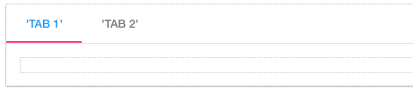

.. image:: ../../images/badges/badge_web.png
   :class: pull-right

Tabs
====

Tabs are control that helps to organize and navigate multiple panels in a single view. Tabs can be used for
switching between items in the view.

|

|

Tabs Reference
--------------

The Tabs control properties can be set for the following property categories:

Main Properties
^^^^^^^^^^^^^^

.. toctree::
   :maxdepth: 1

   webgc-prop-main-id
   webgc-prop-main-template
   webgc-prop-main-name
   webgc-prop-main-label
   webgc-prop-main-whiteframe
   webgc-prop-main-display

|

Toolbar Properties
^^^^^^^^^^^^^^^^^^

.. toctree::
   :maxdepth: 1

   webgc-prop-main-toolbar-visible
   webgc-prop-style-style
   webgc-prop-style-class
   webgc-prop-style-dynamic

Left Menu
'''''''''

Title
'''''

Right Menu
''''''''''

|

Tabs Properties
^^^^^^^^^^^^^^^

|

Styling Attributes
^^^^^^^^^^^^^^^^^^

.. toctree::
   :maxdepth: 1

   webgc-prop-main-flexwidth
   webgc-prop-style-style
   webgc-prop-main-bodystyle
   webgc-prop-style-class
   webgc-prop-style-dynamic

|

Events
^^^^^^

.. toctree::
   :maxdepth: 1

   webgc-events.rst

|

See it in Action
----------------

Try the Sample Tabs

.. toctree::
   :maxdepth: 1

      ../../gsguide/samples/sample-tabs

|

Return to the `Documentation Home <http://localhost:63342/dfd/build/index.html>`_.