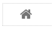
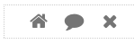

.. image:: ../../images/badges/badge_web.png
   :class: pull-right

Iconbar
=======

 .. image:: ../../images/icons/menu_iconbar.png
    :width: 50px
    :height: 50px

An iconbar is a menu of icons. It has a top level menu that shows icons which is is a menu item. Menu items can have sub
menu items. The iconbar menu is defined in the Menu Editor.

|

and with sample icons:

|

Iconbar Reference
-----------------

The Icon control properties can be set for the following property categories:

Main Properties
^^^^^^^^^^^^^^

.. toctree::
   :maxdepth: 1

   webgc-prop-main-id
   webgc-prop-main-template
   webgc-prop-main-name
   webgc-prop-main-disply
   webgc-prop-main-menuitems

|

Styling Attributes
^^^^^^^^^^^^^^^^^^

Container Stying
''''''''''''''''

.. toctree::
   :maxdepth: 1

   webgc-prop-style-style
   webgc-prop-style-class
   webgc-prop-style-dynamic

|

Menu Stying
'''''''''''

.. toctree::
   :maxdepth: 1

   webgc-prop-style-style
   webgc-prop-style-class
   webgc-prop-style-iconsize
   webgc-prop-style-iconstyle
   webgc-prop-style-iconclass

|

Item Styling
''''''''''''
.. toctree::
   :maxdepth: 1

   webgc-prop-style-style
   webgc-prop-style-class
   webgc-prop-style-iconsize
   webgc-prop-style-iconstyle
   webgc-prop-style-iconclass

|

Events
^^^^^^

.. toctree::
   :maxdepth: 1

   webgc-events.rst

|

See it in Action
----------------

Try the Sample Iconbars

.. toctree::
   :maxdepth: 1

   ../../gsguide/samples/sample-iconbar

|

Return to the `Documentation Home <http://localhost:63342/dfd/build/index.html>`_.
