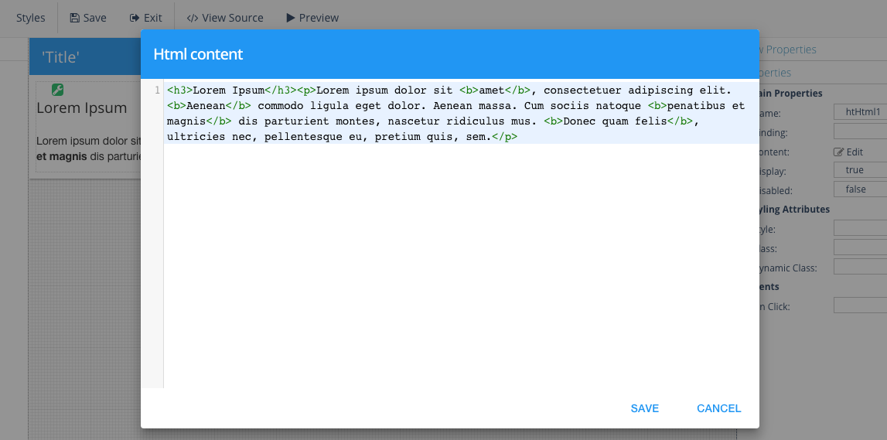

Content
=======

The Content property contains the HTML content that will be displayed in the HTML :term:`GC`

**Value:** Any HTML text

The content can be edited to enter any HTML text manually in a contextual script editor.
The new content will be displayed as soon as it is saved.

|