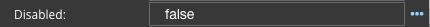

Disabled
========

Disabled is a property to enable / disable a :term:`GC`. If the value is *true* the GC is enabled. When the value is
*false* is disabled, which means even if it is visible it will not will not be functional.

|

**Values:**

* *true* to disable the :term:`GC`
* *false* to enable the :term:`GC`
* *boolean angular expression* that evaulates to *true* or *false*, for example, 5 > 2 would evaluate to *true* and 5 < 2 would evaluate to *false*.
* *$scope variable* simple or complex (ie. array) is defined in the script of the View in the Script Editor.

**Default:** *false*

**Notes:**

Check out the Samples Gallery and mini apps for more examples of Dynamic fields that show or hide using the Disabled property.

The value can either be a literal *true* to disable the GC or *false* to enable it, an angular expression that evaulates
to *true* or *false*, or a $scope variable has a Boolean value (defined in the script of the View in the Script Editor).

On the right hand side of the field you will see **...** indicating that help in defining expression is available.
Click on the *...** and a Expression Editor will be displayed, indicating existing scope variables and functions. You
can use scope variables as part of your angular expression, for example, myVar == 5, would evaluate the expression
using the value stored in the scope variable myVar, if equal to 5 the expression would evaluate to **true** and the text
would be displayed.

See :ref:`angular-expression-label`  for more help on Angular Boolean Expressions

|