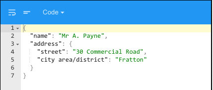
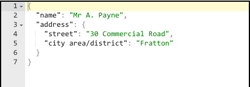

Header Visible
==============

Sets the Type of input to be entered for an input field.

When Header Visible is checked the header looks like this:

When unchecked it looks like this:

**Value:** - Checkbox:

* *checked* header will be visible
* *unchecked* header will not be visible

**Default:** - *checked* header visible

|