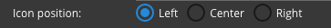

Icon Position
=============

Icon Position indicates where the icon will be positionned in the control. A radio button selection is provided with
values Left, Center or Right corresponding to the position where the icon will be displayed within the :term:`GC`.

**Value:** - Radio Selection: *Left, Center or Right*

**Default:** - *Left*

**Notes:**

The Icon can be positioned Left, Center or Right in the control. Center is used when only the icon is displayed. If there
is text in the control and Center is selected the position will default to Left (the icon cannot be position within the text).

|
