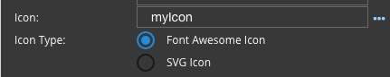

.. _dfx-icon-type-label:

Icon Type
=========

The Icon Type specifies if a custom icon is a Font Awesome Icon or an SVG Icon.

This property is hidden if the field is empty or the Icon Name is a valid string enclosed in quotes or if the  an icon
name is entered that is recognized SVG or Font Awesome Icon. If the entered text is a scope variable, for example
*myIcon* or a string not enclosed in quotes, the Icon Type property is displayed and the user can select Icon Type
SVG Icon or Font Awesome Icon, the Default is *SVG*.

|

**Value** - Radio Selection Font Awesome Icon or SVG Icon

**Default** - *SVG* Icon

**Notes**

If a custom icon name or a scope variable is entered, the Icon Type property is displayed and the type: Font Awesome or
SVG icons can be selected.

A valid icon can always be selected from a list of supported icons by clicking on the **...** symbol to the right of the
field for a list :ref:`dfx-icons-label`

|

Below is an example using a Scope Variable to set the icon name:

::

   Set the scope variable myIcon in the Script Editor

   $scope.myIcon = 'fa-apple';

   Then in the Icon properties name put myIcon

   Icon:  myIcon

   and select Font Awesome Icon radio button.

   The button label is set to 'Apple' and menu items have been defined.
   At runtime the Button will look like this:

|