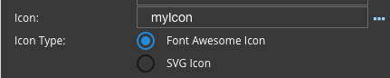

Icon
====

The name of the Icon to use.

|

**Values:**

* **`Name of the icon`** in quotes, for example 'fa-home' entered directly into the field or selected from a list :ref:`dfx-icons-label`
* **Scope Variable** - containing the icon name

**Default** - *None*

**Notes**

Click on the **...** to the right of the Icon Name to select one of the SVG or Font Awesome Icons from a list, see :ref:`dfx-icons-label`.

If the Icon name is a scope variable or not a recognized icon from the list of DreamFace icons, the **Icon Type** Property
will be displayed.

|

Click here for more on the :ref:`dfx-icon-type-label`

|