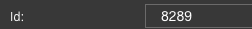

.. _webgc-main-id-label:

Id
==

Id is a unique :term:`GC` identifier generated by DreamFace.

|

**Value:** **nnnnn**, a string of 4 or more digits, example 8289

**Default:** Id is generated by DreamFace.

**Notes:**

This property cannot be modified.

The Id can be used when refering to a :term:`GC` in a script (see Script Editor).

|