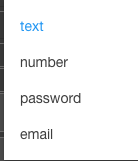

Input Type
==========

Sets the Type of input to be entered for an input field.

**Value:** - Selection List with possible values

* **text** indicates text field
* **number** indicates a number field
* **password** indicates a password field, password fields will be starred when users enters a value.
* **email** indicates an email field, email type requires the field to have an @ and valid characters.

**Default:** - *text*

|