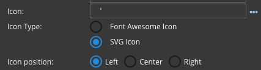

Menu Icon
=========

The Icon of the associated Menu

**Value** - Name of the icon that will be used entered directly into the field or selected from a list see :ref:`dfx-icons-label`

**Default** - None

**Notes**

Click on the **...** to the right of the Icon Name to select one of the SVG or favicons from a list, see :ref:`dfx-icons-label`

|