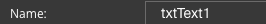

.. _webgc-main-name-label:

Name
====

The Name property is the technical name of the :term:`GC`.

|

**Value:** default :term:`GC` name followed by a number indicating the order in which it was created, ie. *txtText#* for a Statictext.

**Default:** for proposed default Names for Name see :ref:`style-gcnames-label`

**Notes:**

Name is a reference to the component's DOM element. It can be used to dynamically access and set component properties.
DreamFace gives a default name that refers to the :term:`GC` followed a number which cooresponds to the order in which
the control was created. For example, a *statictext* would have a default name of *txtText#*. The second statictext
created will have a default name of *txtText2*. Name is not required and can be removed if needed. For a complete list
see :ref:`style-gcnames-label`.

|