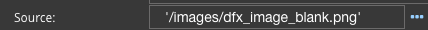
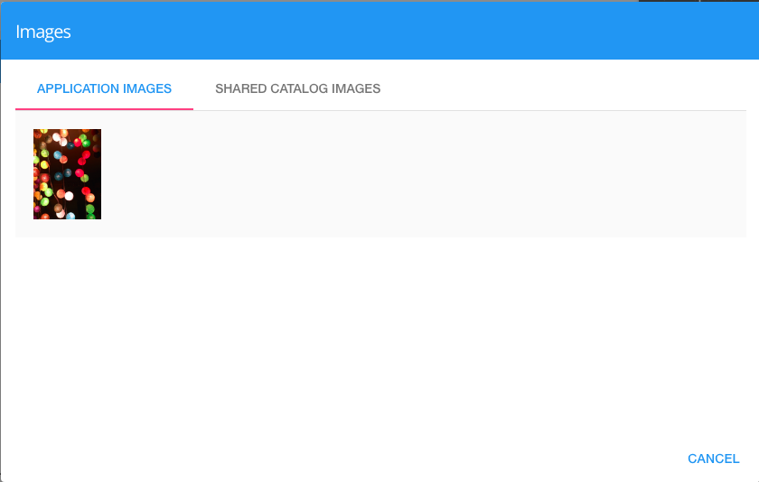

Source
======

The Source Property is used when diplaying an image to define the source of the image. It can be the url or the name of
a resoucre file image.

**Values**

* **url** in quotes or
* **resource name** the image in quotes, for example '/assets/lights.jpg' after adding lights.jpg as a resource

**Default** - *'/images/dfx_image_blank.png'*

**Source**

The source of the image. This can be a url indicating the location of the image as shown in the placeholder in the
field '/images/dfx_image_blank.png' surrounded by quotes or it can be the *name* of a resource that you have added to
DreamFace in the *Application > YourApp > Configuration* option of the the Application Explorer. For a list of
available images click on **...* to the right of the Source field for a list of Application Images or Shared Images
available for use by your application.

For more information on Configuring Resources see *Adding Resources to DreamFace*.

Note that is you use an application resource when you export your wiget for sharing you will also need to provide the
image.
