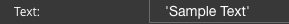

Text
=====

This is the text that will be displayed in a :term:`GC`. The text can be used as a label and usually provides
instructions to guide the user.

|

**Values:**

* **'string'** in quotes - text should be in quotes, otherwise it will be interpreted as a scope variable.
* **angular expression** - an expression that evalutates to a string. Angular expressions are evaluated at runtime.
* **$scope variable** - defined in the script of the View in the Script Editor, ie. $scope.myString = 'Hello World'.

**Default:** *'Sample Text'*

**Notes:**

If your text does not appear in Preview mode, make sure the text is in quotes. If you have an angular
expression that does not appear in Preview mode it could mean that there is an error in your angular expression. Take a
look at the sample angular expressions in the Samples Gallery. If your expression contains an apostrophe, use double
quotes. For example "It's a button" would evaluate to: *It's a button* at runtime or in
in Preview Mode when testing the View Editor.

Text can also be a scope variable. The scope variable name can be added directly in the Text property
field or can be chosen from a list of possible scope variables in the Dialog Help. Dialog help can be reached by
clicking **...** on the right side of the Text property field.

Scope variables can be simple or complex:

* Simple  - scope variable name, for example *myVar*
* Complex - a path to the scope variable, for example *myArray[3].myVar*

If the :term:`GC` is in a repeatable panel and needs to be bound to a repeatable item, use
*$dfx_item.myVar* to get the value. For more information on $dfx_item see :ref:`gcs-dfx-varibles`

See more about how to define an :ref:`angular-expression-label` here.
