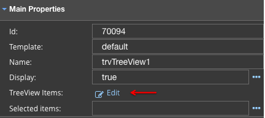
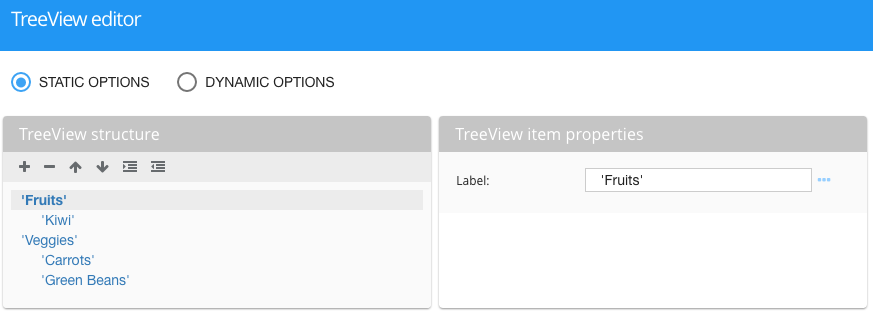
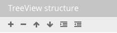
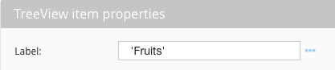
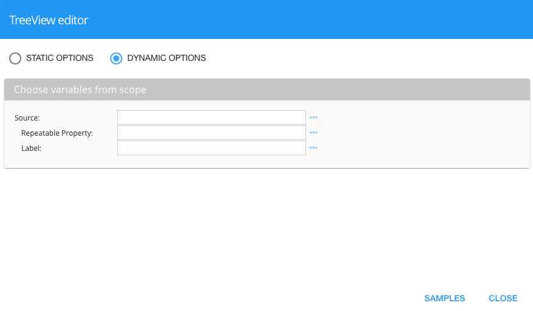

Treeview Items Editor
=====================

The Treeview Editor provides an easy way to create Treeview hierarchies.

The Treeview Items Editor is a visual editor that guides the developer to quickly create or remove treeview items and
organize them in a hierarchy.

|

You can create **Static** or **Dynamic** treeviews.

|

Static Options
''''''''''''''

The static Treeview is created by adding items and giving them a hierarchy using the action icons in the *Treeview
structure* section on the left side of the editor.

**Treeview Structure**

* To create a new item just click on the **+** sign and edit the label.
* To remove an item click on the **-** sign and the item will be removed.
* To move an item up in the list, click on the up arrow action icon.
* To move an item down in the list, click on the down arrow action icon.
* To indent an item making it a sub category of the previous item click on the indent icon.
* To unindent an item brining it up a level in the hierarchy click on the unindent action icon.

**Treeview Item Properties**

TreeView Item properties are set in the TreeView Item Properies section. There you can define the label for each
TreeView Item.

Item labels are strings surrounded by quotes, Angular expressions or scope variables, see :ref:`dfx-webgc-main-label-label`

|

Dynamic Options
'''''''''''''''

Dynamic TreeViews get their content from a variable source.

It can work with json object of different structure. Need to put three parameters into TreeView items section fields of Property Panel:
* **Source** - is name of scope array.
* **Repeatable Property** - name of repeatable scope array property.
* **Label** - name of property that will be TreeView item label.

Example:

::

   $scope.treeview = [{
       "asd": "'default ' + symbol",
       "quantity": "'045'",
       "url": "http://google.com.ua",
       "qwe": [
         {
           "asd": "'products'",
           "qwe": [
             {
               "asd": "'Printers'",
               "qwe": []
             }
           ]
         }
       ]
   }]

To bind the array it to the TreeView we need set in Property Panel:

Source - treeview
Repeatable Property - qwe
Label - asd

To Each GC TreeView item we can connect events from Property Panel.

For example we have simple function in scope:

::

   $scope.clickedItem = function(item) {
	   console.log(item);
   };

And we put into ‘On Double click’ field: selectNode($dfx_item).
As a result in console we will see our doubleClicked item ( an object with all his properties  ).

|

Return to the `Documentation Home <http://localhost:63342/dfd/build/index.html>`_.
