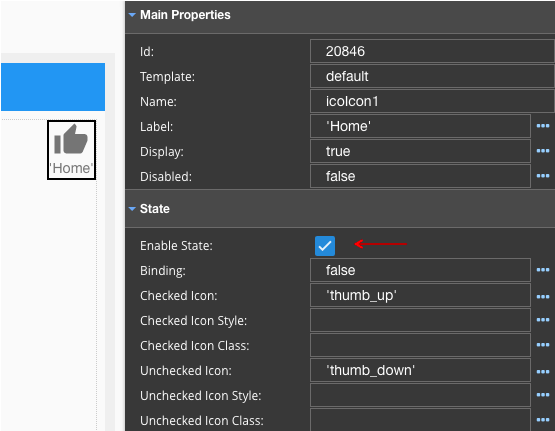
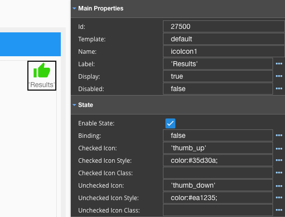

Enable State
============

Enable State allows the GC to have two different states, checked or unchecked, for example Thumbs Up and Thumbs Down.

Binding is boolean value to set/unset state.
Checked Icon is the Icon that will appear when the value is checked or *true*.
Checked Icon Style and Class is the CSS style of the Checked Icon.
UnChecked Icon is the Icon that will appear when the value is unchecked or *true*.
UnChecked Icon Style and Class is the CSS style of the UnChecked Icon.

.. toctree::
   :maxdepth: 1

   webgc-prop-statebinding
   webgc-prop-main-icon
   webgc-prop-style-iconstyle
   webgc-prop-style-iconclass
   webgc-prop-main-icon
   webgc-prop-style-iconstyle
   webgc-prop-style-iconclass

Example
^^^^^^^

In the example below the Binding is set to true to indicate that there will be two states. The default icons are
**'thumbs-up'** and **'thumbs-down'**. Icon style is green for thumbs up and red for thumbs down.

|
