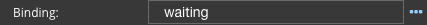
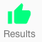
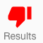

Binding
=======

State binding is a boolean value to set or unset the Wait status or Enabled State. If the value is true then Wait or
State properties lke icon, Icon style and Icon Class will be used to style.

The Wait status shows an icon usually with movement to incicate an action
is being executed, for example a spinner icon spinning while data is being loaded.

|

The Enabled State properties show the an Icon when the state is checked or true and another when the state is
unchecked or false.

|

**Value:**

* *true* to disable the :term:`GC`
* *false* to enable the :term:`GC`
* *boolean angular expression* that evaulates to *true* or *false*, see :ref:`angular-expression-label`
* *$scope variable* must evaluate to a boolean value (true or false) is defined in the script of the View in the Script Editor.

**Default:** *None*

**Notes:**

Your can either type a scope variable name directly or select one from the list of existing scope variables by clicking
on the **...** to the right of the Binding field:

.. image:: ../../images/devguide/dfx-expression-editor.png
   :width: 700px

Binding can be:

* simple: scope variable name (for example myVariable);
* complex: the path to the variable (for example myArray[3].myVariable).

If the :term:`GC` is in a Repeatable Panel and needs to bind to to some repeatable item property, then the binding
should be: $dfx_item.myVariable. For more on $dfx_item see :ref:`dfx-webgc-panel-label`

|
