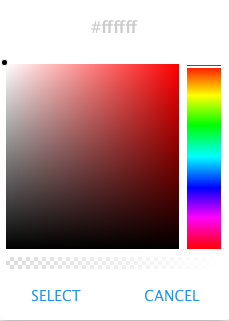

Default Background Color
========================

This property sets the Default Background Color.

|

**Value:** - Color specified in CSS

* **a valid color name** like *red* or *orange* (not in quotes), see `Color Names Supported by All Browsers <http://www.w3schools.com/colors/colors_names.asp>`_
* **RGB value** like "rgb(255, 0, 0)"
* **HEX value** like  #d64626 or **orange**

**Default:** - #ffffff

**Notes:**

Either enter one of the color values in the field or click on the color picker box on the right hand side of the field,
and a colorpicker help window will open up proposing to choose a color.

Once you have chosen the color click on the select button at the bottom of the colorpicker window. To
not choose a color just click on *Cancel*.

|

