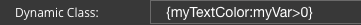

Dynamic
=======

The Dynamic CSS Class is a class that will be added to the graphical control if an Boolean Angular Expression is verified.

|

**Value:** - **expression** Name of CSS Class followed by a boolean expression that sets a style if the expression evaluates to *true*.

**Default:** - *None*

**Notes**

Dynamic class allows us to activate or inactivate classes according to a javascript expression result.

To better understand Dynamic Classes lets look at a few examples:

Example:
::

    rotateGC === true ? ‘fa-pulse’ : ‘’

    Here if scope variable rotateGC (defined in the Script Editor (part of the View Editor)) is equal true, class fa-pulse
    (a class returns an object in a clockwise circle) otherwise the fa-pulse class will not be activated.

Consider the following CSS class:
::

    .RedMessage {
         color: red
    }

    Dynamic class could be an angular expression like

    *RedMessage: my_variable<0*

--- another example might be ---

::

   .RedValue {
       color: red;
   }
   .GreenValue {
       color: green;
   }

   Dynamic class could be an angular expression like

   RedValue: my_variable<0; GreenValue: my_variable>=0

   depending on the value of my_variable, the component will have the RedValue or GreenValue  class.

|

