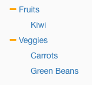
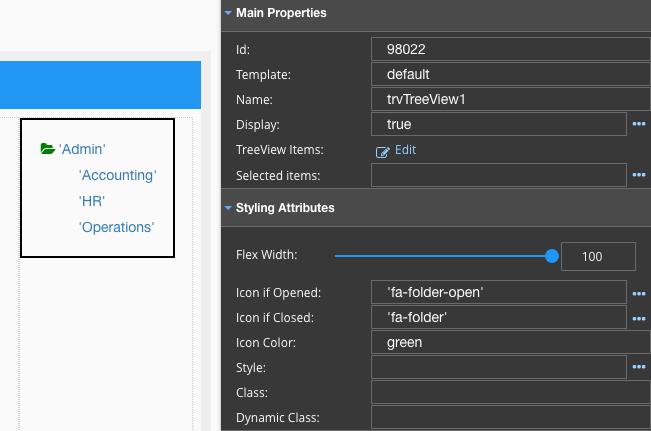

Icon Color
==========

Icon Color is a special styling properties of the TreeView that sets the color of the TreeView Icon. The TreeView Icon is
usually:

* 'fa-plus' - icon indicating TreeView is “closed/collapsed” (children are hidden)
* 'fa-minus' - icon indicating TreeView is “opened/expanded” and can be closed by clicking on the minus (children are visible).

|

**Value:** Color is specified in CSS

* **a valid color name** like *red* or *orange* (not in quotes).
* **RGB valerr** like "rgb(255, 0, 0)"
* **HEX value** like  #d64626 or **orange**

**Default:** - *None*

HTML and CSS supports 140 standard color names. For the full list of supported colors see
`Color Names Supported by All Browsers <http://www.w3schools.com/colors/colors_names.asp>`_

|

Example:
''''''''

For example, for “opened” enter or select in popup window select **‘fa-folder-open’** and for “closed” - **‘fa-folder’**,
and set Icon color to **green**.

|

|