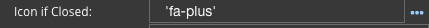
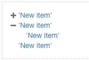

Icon if Opened
==============

Name of icon to be displayed when tree menu is opened, for example 'fa-plus'. indicating that the user can open the
treeview.

Which would look like row 2 in this example, incating that the tree list is collapsed or closed.

|

**Value:** - Icon Name

**Default:** - *'fa-plus'*

|