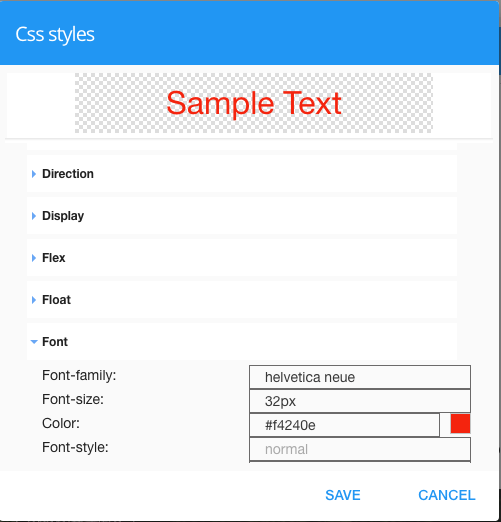

.. _webgc-prop-style-label:

Icon Style
==========

The Style property defines the style of the icon.

|

**Value:** - CSS style attribute(s) to use for this component, separated by semi-colons, for example: *color:red; background-color:lightgray*.

**Default:** - *None*

**Notes:**

By clicking on the **...** on the right hand side of the field, a window opens up proposing to change attributes for
**font**, **color**, **padding** and **margin** presented in a tree. When clicking on the arrow to the left of the
attribute type, the user is guide by placeholder to enter the correct settings.

|

|
