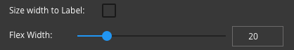

Size to Width
=============

Size the Button to the width of the Label or set the size as a percentage of the column

**Value:** - Checked or Unchecked; checked sizes the Button to the size ot the label, unchecked opens a Flex width slider to define the size of the Button as a percentage of its container in this case the column.

**Default:** - *Checked* size of the Button to the label size

**Notes:**

By checking Size to Width the Button will take the size of the Label

otherwise if unchecked

a Flex Width property will be displayed and the user can set the width of the Button using a slider
as a percentage of the column

Example

Size to Width Checked

Size to Width Unchecked

|
