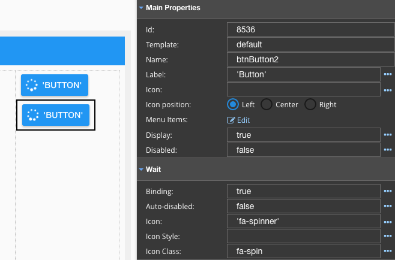

Wait Icon Class
===============

The Wait Icon Class property defines how the wait icon moves while in the wait state, for example does it spin at an
even pace or does it have a rotating effect on the icon.

**Value:** - name of the class to define wait state icon action, (string): for example **'fa-pulse'** or **'fa-spin'**

**Default:** - **`fa-pulse`** to have rotating effect on icon.

To see the difference between 'fa-pulse' and 'fa-spin' you can try the following:

* Create two Button GCs
* Set Binding to **true** on both
* Set Wait Icon Class on second button to **'fa-spin'**
* You can see the difference directly in the View Editor without Previewing

|

|