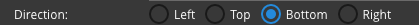

Direction
=========

Tooltip Direction indicates where the tooltip text will appear. A radio button is provided with the values Left,
Top, Bottom or Right corresponding to the position where the tooltip will be displayed relative to the :term:`GC`.

Radio Selection: *Left, Top, Bottom, Right*

The value of this field i                                     |
