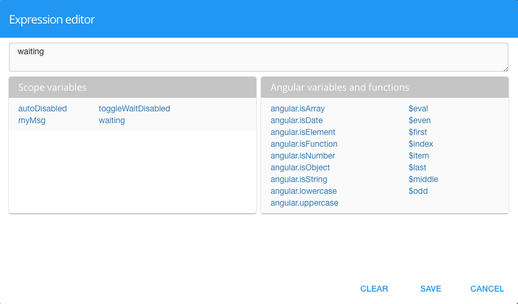

Auto Disabled
===============

Automatically disables the :term:`GC` during the wait cycle.

|

**Value:**

* *true* to disable the :term:`GC`
* *false* to enable the :term:`GC`
* *boolean angular expression* that evaulates to *true* or *false*, for example, 5 > 2 would evaluate to *true* and 5 < 2 would evaluate to *false*.
* *$scope variable* simple or complex (ie. array) is defined in the script of the View in the Script Editor.

**Default:** *false*

(not required)

**Notes:**

Check out the Samples Gallery and mini apps for more examples of Dynamic fields that show or hide using the Display property.

The value can either be a literal *true* to disable the GC during the wait operation or *false* to leave it active,
an angular expression that evaulates to *true* or *false*, or a $scope variable that has a boolean value (defined in the
script of the View in the Script Editor).

Your can either type a scope variable name directly or select one from the list of existing scope variables by clicking
on the **...** to the right of the Binding field:

The scope variable can either be:

* simple: scope variable name (for example myVariable);
* complex: the path to the variable (for example myArray[3].myVariable).

If the :term:`GC` is in a Repeatable Panel and needs to bind to to some repeatable item property, then the binding
should be: $dfx_item.myVariable. For more on $dfx_item see :ref:`dfx-webgc-panel-label`

See :ref:`angular-expression-label`  for more help on Angular Boolean Expressions

|