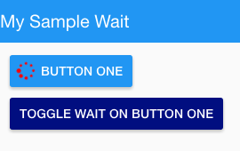

Wait Properties
===============

Wait properties allow the user to set a “Wait” status on a :term:`GC` and define a Icon and its behavior while some
action is being performed, for example loading data. While the in wait mode the :term:`GC`can be disabled.

DFX GCs Wait Extension is Implemented on the following GCs: Icon, Button, Toolbar Button.

An Icon will be displayed and the GC disabled or not during the action being performed. Style and class of the Icon
displayed during the wait can be set dynamically.

|

.. toctree::
   :maxdepth: 1

   webgc-prop-statebinding
   webgc-prop-wait-autodisabled
   webgc-prop-main-icon
   webgc-prop-style-iconstyle
   webgc-prop-style-wait-iconclass

**Notes:**

value (expression): if is set - result of expression must be boolean to set/unset Wait status.
autoDisabled (expression): if is set - result of expression must be boolean to disable or nor GC during Wait.
icon (object): an icon that is showing during Wait. Properties of that icon have highest priority above standart and state properties.

|

Example
^^^^^^^

Create a button with a wait state and another to toggle the wait state.

Wait state off.

Wait state on.

|

Create :term:`GC` Button in View Editor and fill in the **Wait properties** as in the example below:

Then go to the Script Editor and enter the following script:

::

   $scope.waiting = false;
   $scope.autoDisabled = false;

   $scope.toggleWaitDisabled = function() {
		   $scope.waiting = $scope.waiting ? false : true;
      	   $scope.autoDisabled = $scope.autoDisabled ? false : true;
   };

Next - return to the Designer of the View Editor and add another button. Then add toggleWaitDisabled() to onclick Event property.
Change container style to *background-color:midnightblue;* and test.

For the techies only:
Default Wait property object in DreamFace:

::

   {
    "value": "",
    "autoDisabled": false,
    "icon": {
        "value": "'fa-spinner'",
        "type": "fa-icon",
        "style": "",
        "class": "fa-pulse"
    }

|