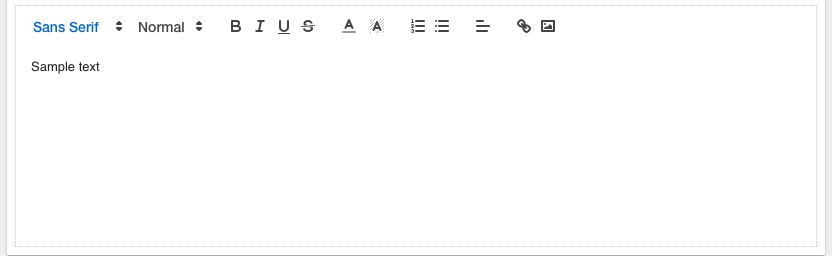

Richtext
========

.. image:: ../../images/icons/icon_web.png
   :class: pull-right

A richtext control is like a   is one of the most important graphical controls in DreamFace because it defines the layout and default style of the
ViewCards. Each ViewCard starts out with a default panel. A panel is a container and it can contain other panels. A DreamFace
panel consists of a toolbar with a title and toolbar menu and an area where the the graphical controls that make up the UI
are organized in a layout. The layout is based on the Angular Material and Material Design layout definition of rows and columns.
Each row can be independently defined and can have one or more columns organized in horizontal or vertical layouts. Default
CSS styles and classes can be defined for the panel.

Text is considered rich if it can display various characters or paragraphs in different styles and features that make it more attractive than a regular ASCII text. Such a text can have some of its sections in different colors. Its paragraphs can have customized attributes or arranged independent of each other.

Although you can create a complete rich but static text, the common use of a rich text is to let the user process most of the formatting.

Creating a Rich Text Control
To support a rich text, the .NET Framework provides the RichTextBox control that is implement from the RichTextBox class. Like TextBox, the RichTextBox class is based on TextBoxBase. Therefore, to have right text in an application, from the Common Controls section of the Toolbox, click RichTextBox and click the form.

|

|

Properties
^^^^^^^^^^

+------------------------+-------------------+--------------------------------------------------------------------------------------------+
| **Main Properties**    | Possible Values   | Description                                                                                |
+========================+===================+============================================================================================+
|Title                   | Any text          | Title text or expression defines title of the panel.                                       |
|                        | Angular Expression|                                                                                            |
|                        |                   |                                                                                            |
+------------------------+-------------------+--------------------------------------------------------------------------------------------+
| Title Visible          | Boolean value     | Title visible can either be set directly using *true* or *false* values or can be the      |
|                        | Angular Expression| result of an angular expression that returns a boolean value of the true or false, $true*  |
|                        |                   | meaning the title will be visible, *false* meaning title will not be displayed.            |
+------------------------+-------------------+--------------------------------------------------------------------------------------------+
| Whiteframe             | number in dp units| Defines the border of the panel in :term:`dp` units, the higher the value of the dp the    |
|                        |                   | more shadow depth the panel will have which helps the user with the perception of which    |
|                        |                   | object is above the other.                                                                 |
+------------------------+-------------------+--------------------------------------------------------------------------------------------+
| Display                | Any text          | Tip to help the user. It will be displayed when mouse passes over this control. Tooltip    |
|                        |                   | text can also be an expression.                                                            |
+------------------------+-------------------+--------------------------------------------------------------------------------------------+

|

+------------------------+-------------------+--------------------------------------------------------------------------------------------+
| **Repeatable**         | Possible Values   | Description                                                                                |
+========================+===================+============================================================================================+
|Repeat for all $item in | Any text          | Title text or expression defines title of the panel.                                       |
|                        | Angular Expression|                                                                                            |
|                        |                   |                                                                                            |
+------------------------+-------------------+--------------------------------------------------------------------------------------------+

|

.. include:: webgc-props-styling.rst

|

+------------------------+-------------------+--------------------------------------------------------------------------------------------+
| **Layout Properties**  | Possible Values   | Description                                                                                |
+========================+===================+============================================================================================+
| row #                  | number            | Number of a row in the panel                                                               |
+------------------------+-------------------+--------------------------------------------------------------------------------------------+
| col #                  | number            | Number of a column in the panel                                                            |
+------------------------+-------------------+--------------------------------------------------------------------------------------------+
| width                  | number in pixels  | The width of the column in pixels. Default value is 100px.                                 |
+------------------------+-------------------+--------------------------------------------------------------------------------------------+
| layout direction       | number            |                                                                                            |
+------------------------+-------------------+--------------------------------------------------------------------------------------------+
| Hor. alignment         | number            | This value is chosen from a drop down list. Default value is *start*.                      |
+------------------------+-------------------+--------------------------------------------------------------------------------------------+
| Ver. alignment         | number            | This value is chosen from a drop down list. Default value is *start*.                      |
+------------------------+-------------------+--------------------------------------------------------------------------------------------+
| Style                  | CSS styles        | CSS style attribure(s) to use for this component, separated by semi-colons, for example:   |
|                        |                   | *color:red; background-color:lightgray*.                                                   |
+------------------------+-------------------+--------------------------------------------------------------------------------------------+
| Classes                | CSS class         | Name of CSS class to use for the component.                                                |
+------------------------+-------------------+--------------------------------------------------------------------------------------------+
| Dynamic Classes        | CSS Class         | The Dynamic Class is a CSS class that will be added to the graphical control if an Angular |
|                        |                   | Expression is verified. It is rendered as a ng-class attribute.                            |
+------------------------+-------------------+--------------------------------------------------------------------------------------------+

|
|
