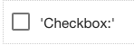

.. image:: ../../images/badges/badge_web.png
   :class: pull-right

Checkbox
========

The CheckBox control allows the end-user to toggle an option on or off by checking the box associated with a label, usually
reflecting a Boolean value, zero or more options can be checked.

|

|

See it in Action
----------------

* `Try some Checkbox Examples <http://dfbluemixsrv02.market-interactive-clouds.com/studio/widget/web/Samples/welcome1/index.html>`_
* Download Examples from Github

|

Reference
---------

The Checkbox control properties can be set for the following property categories:

|

Main Properties
^^^^^^^^^^^^^^

.. toctree::
   :maxdepth: 1

   webgc-prop-main-id
   webgc-prop-main-template
   webgc-prop-main-name
   webgc-prop-main-label
   webgc-prop-main-icon
   webgc-prop-main-display
   webgc-prop-main-disabled

|

Styling Attributes
^^^^^^^^^^^^^^^^^^

.. toctree::
   :maxdepth: 1

   webgc-prop-style-style
   webgc-prop-style-class
   webgc-prop-style-dynamic

|

+------------------------+----------------------+--------------------------------------------------------------------------------------------+
| **Main Properties**    | Possible Values      | Description                                                                                |
+========================+======================+============================================================================================+
| Id                     | 5 digit string       | A unique ID composed of 5 or more digits used to identify this graphical control.          |
|                        |                      | It is generated by DreamFace and can be used when refering to this control in the script.  |
+------------------------+----------------------+--------------------------------------------------------------------------------------------+
| Template               | *Any text*           | The name of the template to be used for this control. The default value is ‘default’.      |
|                        |                      | For more information on Templates in DreamFace see :ref:`dfx-templates-label`              |
+------------------------+----------------------+--------------------------------------------------------------------------------------------+
| Name                   | chkCheckbox#         | Name is a reference to the component's DOM element. It can be used to dynamically access   |
|                        |                      | and set component properties. DreamFace gives a default name of *chkCheckbox#* where #     |
|                        |                      | corresponds to the order in which the control was created. If it's the second control      |
|                        |                      | created it will have a default Name of *chkCheckbox2*. Name is not required and can be     |
|                        |                      | removed if not needed.                                                                     |
+------------------------+----------------------+--------------------------------------------------------------------------------------------+
| Binding                | scope variable       | The databinding of the checkbox control to an angular scope variable. Type a scope         |
|                        | *string*             | variable name or select from possible scope variables by clicking on the **...** to the    |
|                        |                      | right of the Binding field to open the Expression Editor to choose one:                    |
|                        |                      |                                                                                            |
|                        |                      |        .. image:: ../../images/gcs/dfx-expression-editor.png                               |
|                        |                      |                                                                                            |
|                        |                      | Binding can be:                                                                            |
|                        |                      | simple: scope variable name (for example myVariable);                                      |
|                        |                      | complex: the path to the variable (for example myArray[3].myVariable).                     |
|                        |                      |                                                                                            |
|                        |                      | If the checkbox is inside Repeatable Panel and needs to bind to to some repeatable  item   |
|                        |                      | property, then the binding should be: myVariable.value[$dfx_index].                        |
|                        |                      |                                                                                            |
+------------------------+----------------------+--------------------------------------------------------------------------------------------+
| label                  | '*any text*'         | This is the text label that will be displayed above the Checkbox control. It usually       |
|                        | *angular expression* | contains a description of the Checkbox. It can be a text between single quotes or an       |
|                        |                      | angular expression.                                                                        |
|                        |                      |                                                                                            |
|                        |                      | If the label text is not in quotes, it will be treated like a variable.                    |
|                        |                      |                                                                                            |
|                        |                      | **The label can also be an angular expression** which will be evaluated at runtime.        |
|                        |                      |                                                                                            |
|                        |                      | See more about how to define :ref:`angular-expression-label` here.                         |
|                        |                      |                                                                                            |
|                        |                      | **Note** - If your label doesn't appear in Preview mode, make sure the text is in quotes.  |
|                        |                      | If you have an angular expression that does not appear in Preview mode it means that their |
|                        |                      | most likely an error in your angular expression. Take a look at the sample angular         |
|                        |                      | expressions in the Samples Gallery. If your expression contains an apostrophe, use double  |
|                        |                      | quotes. For example "It's a button" would evaluate to: *It's a button* at runtime or in    |
|                        |                      | in Preview Mode when testing the View.                                                     |
+------------------------+----------------------+--------------------------------------------------------------------------------------------+
| Options                | Edit                 | This is the text that will appear under the icon, for example the fa-home icon could have  |
|                        |                      |                                                                                            |
|                        |                      |        .. image:: ../../images/gcs/dfx-options-editor.png                                  |
+------------------------+----------------------+--------------------------------------------------------------------------------------------+
| icon                   | favicon              | Click on the **...** to the right of the field to select one of the favicons from the list.|
|                        |                      |                                                                                            |
|                        |                      |        .. image:: ../../images/gcs/dfx-icons.png                                           |
+------------------------+----------------------+--------------------------------------------------------------------------------------------+
| Display                | *true* or *false*    | The value can either be a literal *true* to display the field or *false* to hide it, or it |
|                        | angular expression   | be a angular expression that evaulates to *true* or *false*, for example,                  |
|                        | default = true       |                                                                                            |
|                        |                      | 5 > 2 would evaluate to *true* and 5 < 2 would evaluate to *false*                         |
+------------------------+----------------------+--------------------------------------------------------------------------------------------+
| Disabled               | *true* or *false*    | *true* to disable the field or *false* to make it active or it can be an angular expression|
|                        | angular expression   | that evaulates to *true* or *false*, for example,                                          |
|                        | default = false      |                                                                                            |
|                        |                      | 5 > 2 would evaluate to *true* and 5 < 2 would evaluate to *false*                         |
|                        |                      |                                                                                            |
+------------------------+----------------------+--------------------------------------------------------------------------------------------+

|

.. _webgc-checkbox-render-label:

Rendering
^^^^^^^^^

This is the rendering section.

|

.. _webgc-checkbox-styling-label:

Styling Attributes
^^^^^^^^^^^^^^^^^^

+------------------------+-------------------+--------------------------------------------------------------------------------------------+
| **Styling Attributes** | Possible Values   | Description                                                                                |
+========================+===================+============================================================================================+
| Style                  | CSS syles         | CSS style attribure(s) to use for this component, separated by semi-colons, for example:   |
|                        |                   | *color:red; background-color:lightgray*. By clicking on the **...** on the right hand side |
|                        |                   | of the field, a window opens up proposing to change attributes for **font**, **color**,    |
|                        |                   | **padding** and **margin** presented in a tree. When clicking on the arrow to the left of  |
|                        |                   | the attribute type, the user is guide by placeholder to enter the correct settings         |
|                        |                   |                                                                                            |
|                        |                   |        .. image:: ../../images/gcs/dfx-icon-css.png                                        |
+------------------------+-------------------+--------------------------------------------------------------------------------------------+
| Classes                | CSS class         | Name of CSS class to use for the component.                                                |
+------------------------+-------------------+--------------------------------------------------------------------------------------------+
| Dynamic Classes        | CSS Class         | The Dynamic Class is a CSS class that will be added to the graphical control if an Angular |
|                        |                   | Expression is verified. It is rendered as a ng-class attribute.                            |
+------------------------+-------------------+--------------------------------------------------------------------------------------------+

|

|

Events
^^^^^^

.. toctree::
   :maxdepth: 1

   webgc-events-onchange.rst

Return to the `Documentation Home <http://localhost:63342/dfd/build/index.html>`_.

|
