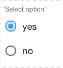

.. image:: ../../images/badges/badge_web.png
    :class: pull-right

Radio
=====

The Radio control allows the end-user to toggle an option on or off by checking the box associated with a label, usually
reflecting a Boolean value. Only one radio control can be selected at a time.

|

|

See it in Action
----------------

* `Try some Radio Samples <http://dfbluemixsrv02.market-interactive-clouds.com/studio/widget/web/Samples/welcome1/index.html>`_
* Download Samples from Github

|

Reference
---------

The Radio control properties can be set for the following property categories:

Main Properties
^^^^^^^^^^^^^^

.. toctree::
   :maxdepth: 1

   webgc-prop-main-id
   webgc-prop-main-template
   webgc-prop-main-name
   webgc-prop-main-binding
   webgc-prop-main-label
   webgc-prop-main-options
   webgc-prop-main-direction
   webgc-prop-main-display
   webgc-prop-main-disabled

|

Styling Attributes
^^^^^^^^^^^^^^^^^^

Container Stying
''''''''''''''''

.. toctree::
   :maxdepth: 1

   webgc-prop-style-style
   webgc-prop-style-class
   webgc-prop-style-dynamic

|

Label Stying
''''''''''''

.. toctree::
   :maxdepth: 1

   webgc-prop-style-style
   webgc-prop-style-class

|

Item Styling
''''''''''''
.. toctree::
   :maxdepth: 1

   webgc-prop-style-style
   webgc-prop-style-class
   webgc-prop-style-style
   webgc-prop-style-class

|

Events
^^^^^^

.. toctree::
   :maxdepth: 1

   webgc-events-onchange.rst

Return to the `Documentation Home <http://localhost:63342/dfd/build/index.html>`_.

|