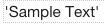

Statictext
===========

.. image:: ../../images/icons/icon_web.png
   :class: pull-right

Statictext controls display text that does not require user input. They often serve as labels for other controls or to indentify
areas of the View. They can also be used to display icons that add context to the user interface.

|

|

The Statictext control properties can be set for the following categories of properties:

* :ref:`webgc-statictext_main-label`
* :ref:`webgc-statictext_styling-label`
* :ref:`webgc-statictext_tooltip-label`
* :ref:`webgc-statictext_events-label`
* :ref:`webgc-statictext_extended-label`

|

.. _webgc-statictext_main-label:

Main Properties
---------------

+------------------------+-------------------+--------------------------------------------------------------------------------------------+
| **Main Properties**    | Possible Values   | Description                                                                                |
+========================+===================+============================================================================================+
| Id                     | nnnnn             | Id is a unique identifier that is 5 or more digits long. It is generated by DreamFace and  |
|                        |                   | can be used when refering to this field in script.                                         |
+------------------------+-------------------+--------------------------------------------------------------------------------------------+
| Name                   | txtText1#         | Name is a reference to the component's DOM element. It can be used to dynamically access   |
|                        |                   | and set component properties. DreamFace gives a default name of *txtText#* where #         |
|                        |                   | corresponds to the order in which the control was created. The second statictext created   |
|                        |                   | will have a default Name of *txtText12*. Name is not required and can be removed if not    |
|                        |                   | needed.                                                                                    |
+------------------------+-------------------+--------------------------------------------------------------------------------------------+
| Text                   | Any text or       | Any text that will be displayed in the field. It should be in quotes, otherwise it will be |
|                        | angular expression| treated as a variable.                                                                     |
|                        |                   |                                                                                            |
|                        |                   | **Text can also be an angular expression** which will be evaluated at runtime.             |
|                        |                   |                                                                                            |
|                        |                   | See more about how to define :ref:`angular-expression-label` here.                         |
|                        |                   |                                                                                            |
|                        |                   | **Note** - If your label doesn't appear in Preview mode, make sure the text is in quotes.  |
|                        |                   | If you have an angular expression that does not appear in Preview mode it means that their |
|                        |                   | most likely an error in your angular expression. Take a look at the sample angular         |
|                        |                   | expressions in the Samples Gallery. If your expression contains an apostrophe, use double  |
|                        |                   | quotes. For example "It's a button" would evaluate to: *It's a button* at runtime or in    |
|                        |                   | in Preview Mode when testing the View.                                                     |
|                        |                   |                                                                                            |
+------------------------+-------------------+--------------------------------------------------------------------------------------------+
| Display                | *true* or *false* | The value can either be a literal *true* to display the field or *false* to hide it, or it |
|                        | angular expression| can be a angular expression that evaulates to *true* or *false*, for example,              |
|                        |                   | 5 > 2 would evaluate to *true* and 5 < 2 would evaluate to *false* because 5 is not less   |
|                        |                   | than 2. It is also possible to use $scope variables that are already defined.              |
|                        |                   |                                                                                            |
|                        |                   | On the right hand side of the field you will see **...** indicating that help in defining  |
|                        |                   | expression is available. Click on the *...** and a Expression Editor will be displayed,    |
|                        |                   | indicating defined scope variables and functions. You can use existing scope variables in  |
|                        |                   | as part of your angular expression, for example, myVar == 5, would evaluate the expression |
|                        |                   | using the value stored in the scope variable myVar, if equal to 5 the expression would     |
|                        |                   | evaluate to **true** and the text would be displayed.                                      |
|                        |                   |                                                                                            |
|                        |                   | See :ref:`angular-expression-label`  for more help.                                        |
+------------------------+-------------------+--------------------------------------------------------------------------------------------+

|

.. _webgc-statictext_styling-label:

.. include:: webgc-props-styling.rst

|

.. _webgc-statictext_tooltip-label:

Tooltip Properties
------------------

+------------------------+-------------------+--------------------------------------------------------------------------------------------+
| **Tooltip Properties** | Possible Values   | Description                                                                                |
+========================+===================+============================================================================================+
| Tooltip Text           |  Any text         | Tip to help the user know what to do. It will be displayed when mouse passes over this     |
|                        |                   | control. The Tooltip Text can also be an expression.                                       |
+------------------------+-------------------+--------------------------------------------------------------------------------------------+
| Tooltip Direction      | Left, Top,        | A radio button is provided with the values Left, Top, Bottom or Right corresponding to the |
|                        | Bottom, Right     | position where the tooltip will be displayed relative to the text.                         |
+------------------------+-------------------+--------------------------------------------------------------------------------------------+

|

.. _webgc-statictext_events-label:

.. include:: webgc-props-events.rst

|

.. _webgc-statictext_extended-label:

Extended Directive
------------------

+------------------------+-------------------+--------------------------------------------------------------------------------------------+
| **Extended Directive** | Possible Values   | Description                                                                                |
+========================+===================+============================================================================================+
|  Add Directive         | function name     | This allows developers to add extended directives to customize the default Statictext      |
|                        |                   | and add functionality. When you click on *Add Directive*                                   |
+------------------------+-------------------+--------------------------------------------------------------------------------------------+

|
|
