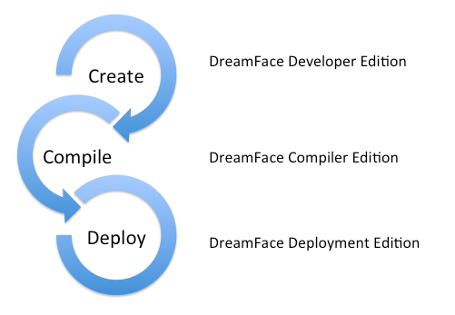

What is DreamFace?
^^^^^^^^^^^^^^^^^

*DreamFace is an open-source development platform for creating modular and dynamic, cloud-native desktop and mobile applications.*

DreamFace applications are a composition of user interface and data access components. The goal of DreamFace is to leverage best of
breed technologies to empowers developers to create cloud-based desktop or mobile cross-platform business applications.

The goal of DreamFace is to leverage best of breed technology and empower developers to
create well-architected, beautiful and secure applications that are open and extensible, and scale to the limits of the cloud.
DreamFace helps developers focus on providing a great user experience by simplifying tedious and repetitive tasks and providing an
unparelled, out of the box fearture set.

DreamFace X-Platform (DFX or just DreamFace as we will refer to it in this documentation) is a part of emerging category of cloud-native Rapid
Application Development Platforms for delivering Enterprise scale Web and Mobile applications with ease and speed, producing uncompromising User
Experiences, and delivering the right data to the right user on the right device by secure and code-less consumption of any public or private API.

DreamFace accelerates development with a Widget Editor providing drag and drop development. In the Widget Editor, pre-defined graphical controls are
dragged on to an panel and properties and attributes are set, minimizing the coding required and allowing developers to focus on creating the user
experience. Developers can drop into code when the user interface requires specific customization and they have always have access to underlying assets
of the application in the DreamFace Repository which contains a description of each component in JSON format.

DreamFace was created to ease development of two difficult and time consuming tasks:

* **User Interface** - industrialize and simplify the creation of beautiful, complex user interfaces for multiples screens
* **Back-End Data Integration** - codeless and secure intregration of virtually any API or back-end data source

The X-Platform part of the DreamFace name refers to the cross platform development. With DreamFace you can build applications for web or mobile with dedicated editors for creating the user interface for web and mobile environments. DreamFace offers several options. You can create a responsive web application that adapts to web and mobile use by adjusting to the screen size of the device automatically in a responsive way or you can create specific Web and Mobile versions of your application that reuse the same back-end query components. In the case of mobile deployment DreamFace provides tools to create cross platform mobile versions of your application. This flexibility lets you decide which is the best platform for your application.

DreamFace is built on the MEAN Stack, MongoDB, ExpressJS, Angularjs and Nodejs.

Who is DreamFace for?
^^^^^^^^^^^^^^^^^^^^^

**DreamFace is for Developers**

DreamFace was built to empower developers by giving them a platform with built-in best practices for building cloud-native desktop and mobile applications.
Multi-tenancy and enterprise-scale features are built-in and ready to use helping the developer to deliver consistently well architected and scalable application
every time.

Because of it's modular approach to development, DreamFace allows teams of different skill levels to work together and leverage each others skills to the benefit
the project. For example, a developer who is much better at building the user interface and knows web technologies could create the DataWidgets, Application Screens
(compositions of DataWidgets) and application branding and a developer with more backend skills could create the DataQueries that access the backend data. Then just put them together to visualise the data. The same DataQueries can be used for both web and mobile applications.

What you need to know
^^^^^^^^^^^^^^^^^^^^^

DreamFace is a platform that empowers MEAN Stack developers. Developers can leverage it to take care of the application infrastructure and focus their efforts on
building great user experience and applications. To get the maximum benefit from DreamFace developers should have a working knowledge of the following technologies :

* Standard Web Technologies (HTML5, CSS3, Javascript)
* Angular.js
* MongoDB
* Node.js

Good to know :

* Jade
* REST Services
* JQuery

Architecture of the DreamFace Platform
^^^^^^^^^^^^^^^^^^^^^^^^^^^^^^^^^^^^^^

The DreamFace Platform that you use to develop applications has 3 main components:

* **DreamFace Developer Edition** Edition* which includes includes the DreamFace Studio
* **DreamFace Compiler Edition** which is used to compile applications and manage different builds of your application
* **DreamFace Deployment Edition** which hosts deployed apps

DreamFace Deployment Edition
----------------------------

DreamFace Compiler
------------------

DreamFace Deployment
--------------------

Anatomy of a DreamFace App
^^^^^^^^^^^^^^^^^^^^^^^^^^

DreamFace applications are built using four main components :

Application Components
----------------------

====================   ==========================================================================================================================================
 **Component**         **Description**
====================   ==========================================================================================================================================
 **Navigation Menu**   Menu and Sub-Menus provide navigation through the application. Navigation starts with a Home Menu linked to the Home Page of the application.
 **Pages**             Applications can have several Pages, each Page is composed of a number of Views arranged in a layout of rows and columns which makes up the user interface of the application
 **Views**             Views (sometimes called Widgets) contain graphical controls like input fields and buttons, arranged in a layout of rows and columns which makes up the User Interface of the View
 **API Services**      API Services provide access to the data by defining the different API Routes related to that service
====================   ==========================================================================================================================================

|

Ananotmy of a DreamFace app
---------------------------

Each DreamFace application has three main parts :

- System Configuration and Settings
- Application Personalisation
- Application Components

In System Configuration and Settings we have

- General Settings
- Security Providers
- Resources
    - Javascript
    - CSS
    - Images
    - All assets
- Deployment

Application Personalization

- Application Roles
- User Access Rights
- Application Users

Application Components

- Navigation Menu
- Views
- API Services / Routes
- Pages (for desktop apps, mobile apps don’t have pages since they display one view at a time)

Views, API Services and Pages can be grouped into Categories which is  a logical association between components. The Default Category is Default, you can add others.

Two ways to search for Views, I can click on Views and see all the Views for the current application. I can also click on the search loop and search for views.

You can click on View Editor and go directly to the Widget editor to modify the View. The View Editor is opened in a separate tab so the developer can work on several Views at the same time in different tabs.

The API Services

Meta data can be shown directly and each element can be expanded.

Versionning - each application has it’s own dedicated github repository.

Deleting the App would delete everything attached to the app.

Shared Catalogue - Components that are shared across apps are stored in the shared catalogue. You can copy a view from one app to another.

* Application Settings
* Navigation Menu
* Pages
* Views
* API Services

Development Process
-------------------

**Bottom-up development**

Although DreamFace allows both top-down and bottom-up development most developers prefer the bottom up approach.
