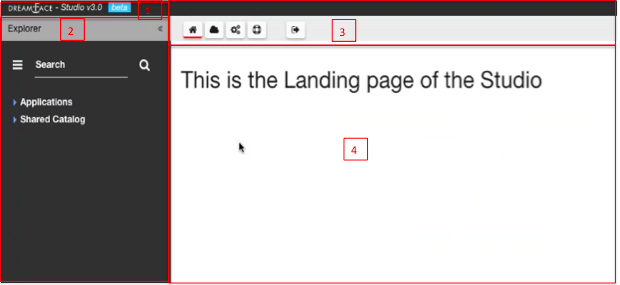
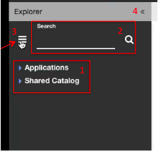

Exploring the Studio
====================

|

|

Welcome to the DreamFace Studio!

When you first arrive you will notice that page is divided into four sections :

1. **Logo and Version Number**
2. **Icon Bar**
3. **Explorer Panel**
4. **Landing Page and Workspace**

Let's explore each of these sections

Logo, Version and Page Title
^^^^^^^^^^^^^^^^^^^^^^^^^^^
In the upper left corner of the page is the DreamFace logo and Version number. The version number indicates the version of
DreamFace being used.

Icon Bar
^^^^^^^^
In the upper right section is the Icon Bar. The Icon Bar is a tool bar that goes across the top of the browser page which
contains icons for different operations that can be performed.

Explorer Panel
^^^^^^^^^^^^^^

Just below the Logo is the Explorer Panel.

|

The Explorer contains a List of Applications and a Catalog of Shared components. The Explorer allows users to navigate
through applications and their components as well as components shared by all applications. It has search capabilities and
a menu for quick access to different editors in the studio without navigating through the different components.

#. Application Tree and Shared Catalog - The Explorer panel contains a tree control with the list of applications and their elements
#. Search Box - in this search box you can type the name of a component that you want to use, DreamFace will position you on it
#. Direct Access Menu - a list of main functions that can be accessed directly without navigating the tree structure
#. Left Panel Collapse icon - Clicking on this icon will collapse and expand the Left Pane

|

Landing Page & Workspace
^^^^^^^^^^^^^^^^^^^^^^^

Lower right section of the page contains the Landing Page and gives instructions on how to use the Studio, where to start
with a top down or bottom up approach.

|
|
