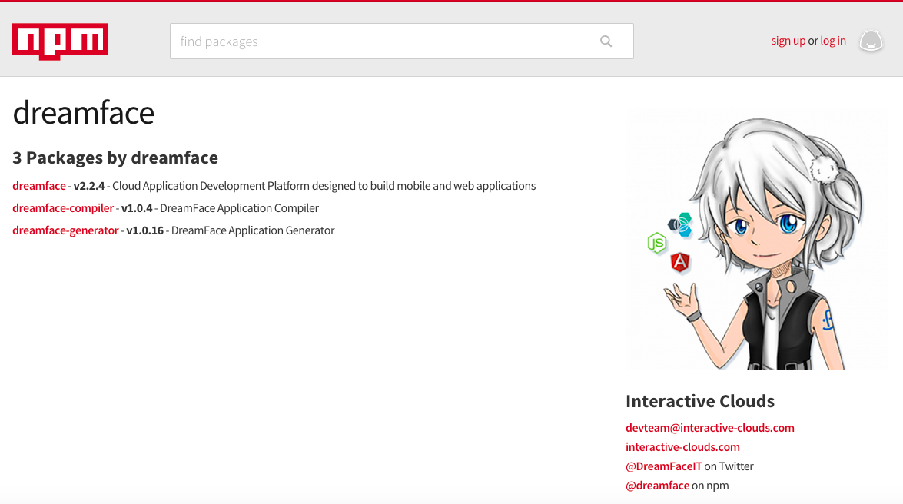

Installation Old
================

Today DreamFace is available in three environments :

.. _bluemix-label:

IBM BlueMix
^^^^^^^^^^^

DreamFace is available as a service on BlueMix. Just go on BlueMix, choose the DreamFace Service from the catalog. DreamFace will create a unique cloud tenant for you and you can start building applications in the cloud immediately.

For instructions on how to get the DreamFace service on BlueMix, watch the video demonstration below :

|

.. raw:: html

        <object width="480" height="385"><param name="movie"
        value="http://www.youtube.com/v/h5QxOAxH5zM&hl=en_US&fs=1&rel=0"></param><param
        name="allowFullScreen" value="true"></param><param
        name="allowscriptaccess" value="always"></param><embed
        src="http://www.youtube.com/v/h5QxOAxH5zM&hl=en_US&fs=1&rel=0"
        type="application/x-shockwave-flash" allowscriptaccess="always"
        allowfullscreen="true" width="480"
        height="385"></embed></object>

|

To install DreamFace on the IBM BlueMix you can also visit the `Download <http://interactive-clouds.com/developercommunity.html#download>`_ page of our website and follow the instructions. You'll be taken directly to the IBM login / registration page for the version you are looking for. Once logged in you can get DreamFace and start building your web applications right away.

.. _marketplace-label:

IBM Cloud MarketPlace
^^^^^^^^^^^^^^^^^^^^

DreamFace is also available on the IBM Cloud Marketplace. If you just want to give DreamFace a spin you can start with a 30-day free trial.For  Once you login and choose DreamFace, a cloud tenant is automatically created and in a few minutes you can begin using DreamFace.

For instructions on how to get started in on the IBM Cloud Marketplace you can watch the video demonstration below :

|

.. raw:: html

        <object width="480" height="385"><param name="movie"
        value="http://www.youtube.com/v/Z-g0r2fxJRo&hl=en_US&fs=1&rel=0"></param><param
        name="allowFullScreen" value="true"></param><param
        name="allowscriptaccess" value="always"></param><embed
        src="http://www.youtube.com/v/Z-g0r2fxJRo&hl=en_US&fs=1&rel=0"
        type="application/x-shockwave-flash" allowscriptaccess="always"
        allowfullscreen="true" width="480"
        height="385"></embed></object>

|

To install DreamFace on the IBM Cloud Marketplace you can also visit the `Download <http://interactive-clouds.com/developercommunity.html#download>`_ page of our website and follow the instructions. You'll be taken directly to the IBM login / registration page for the version you are looking for. Once logged in you can get DreamFace and start building your web applications right away.

|
|

.. _npm-label:

npm (Node Package Manager)
^^^^^^^^^^^^^^^^^^^^^^^^^^
A full-featured, open-source version of DreamFace can be installed on-premise or on a cloud server using the npm utility.
Even though this is a manual installation, DreamFace provides a generator to simplify and automate many of the steps involved.

Step-by-step instructions for installing on npm are provide here :ref:`npminstall-label`

|

|
|