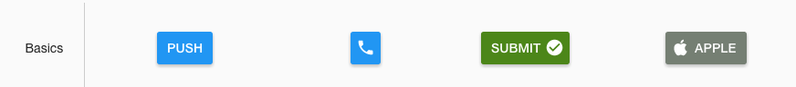
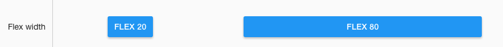
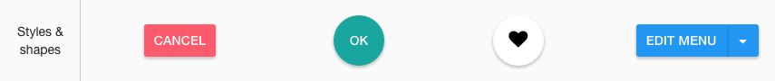
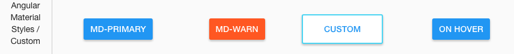
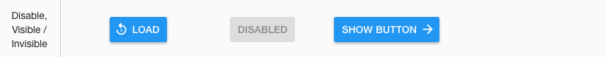
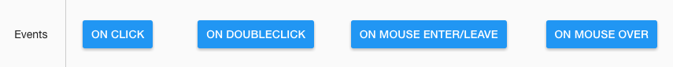

Sample Buttons
==============

A Page with a full range of Sample Buttons is provided below in the Samples Application. By visiting the Sample Buttons
page you can test the functionality and play with the sample Buttons. By importing this page from the Github Samples
repository you will be able to use the samples in your applications.

* `Try Sample Buttons <http://50.22.58.40:3300/deploy/qa/Samples/web/1.0.1/index.html#/page.html?login=guest&name=Sample1Buttons>`_
* Download Samples from Github

|

Sample Categories - different kinds of Buttons are provided as examples:

|

Basics
------

Basic Button samples show different labels, icons and colors. They have no event actions and therefore do nothing when clicked, etc.

The sample basic buttons include:

* a button with a label
* a button with an icon
* a button with a label and an icon on the right
* a button with a label and an icon on the left.

|

Flex width
----------

Flex Width Buttons show how button width can either be determined by the width of the label or be set by the flex value provided.

The samples include:

A Button with the label *FLEX 20*.

* The width is auto-sized based on the width of the label.
* The Styling Properties / Container Styling / *Size width to Label* is checked.
* .. image:: ../../images/devguide/samples/sample-buttons-flex-labelw.png

A Button with the label *FLEX 80*.

* The width set by the flex value, in this case 80%.
* The Styling Properties / Container Styling / *Size width to Label* is unchecked.
* The Flex Width slider is set to 80%
* .. image:: ../../images/devguide/samples/sample-buttons-flex-flexw.png

|

Styles
------

Styles samples show examples of a color, shape and label changes (the first three buttons). The fab button with a
heart icon applies a dynamic class property to change the color of a heart when clicked. The last button in this category
has a drop-down menu which is activated by clicking on the arrow on the right hand side

|

Angular Material
----------------

|

Disable, visible / invisible
----------------------------

In this category we see an example of the wait property to display a loading effect when a button is pressed. Also we have an example of a "visible / invisible button". Clicking "SHOW NEXT" triggers appearance of another button which displays a dialog box when pressed.

|

Events
------

Also there are examples of the background and icon color change.

|

